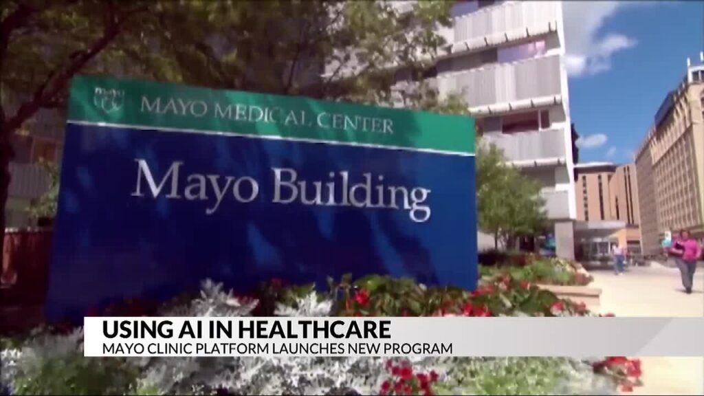
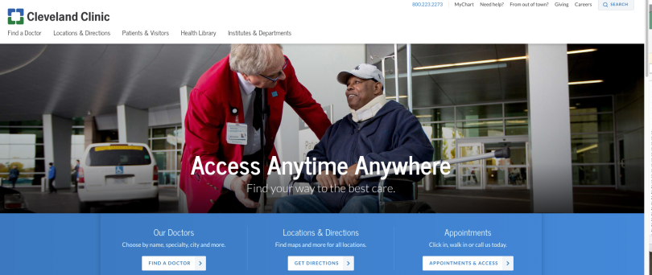
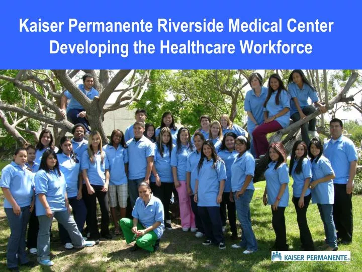
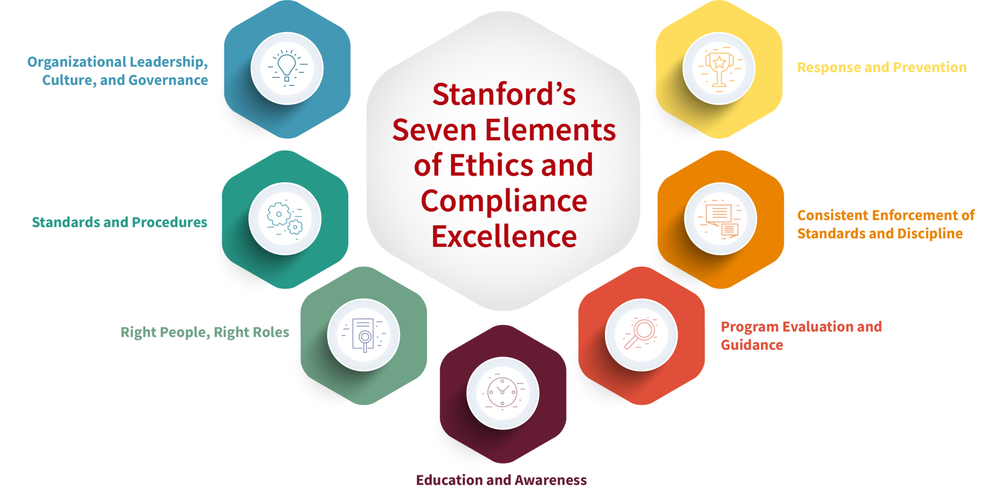
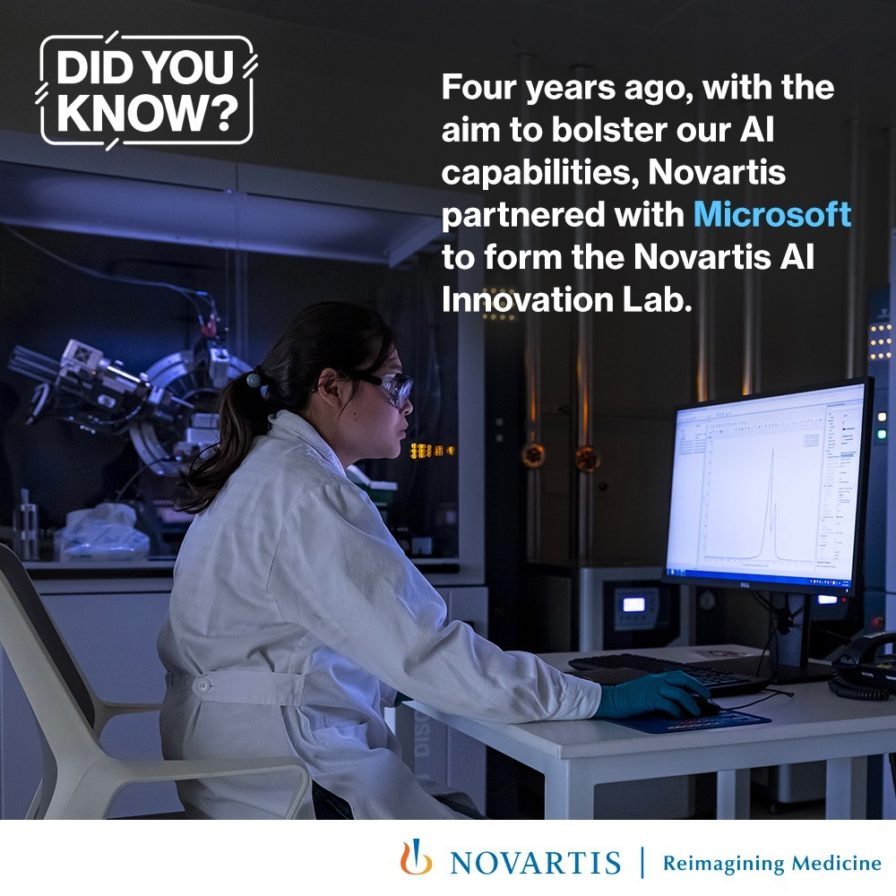
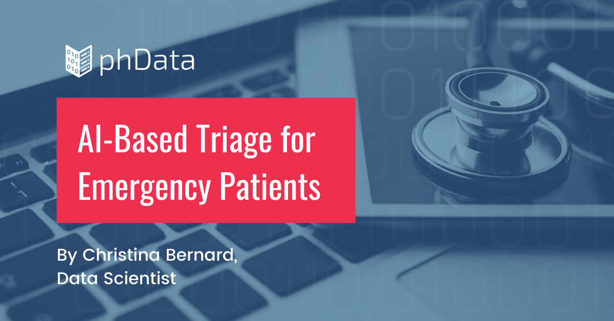
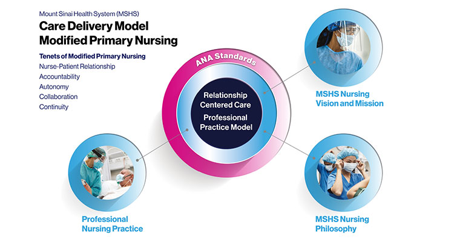
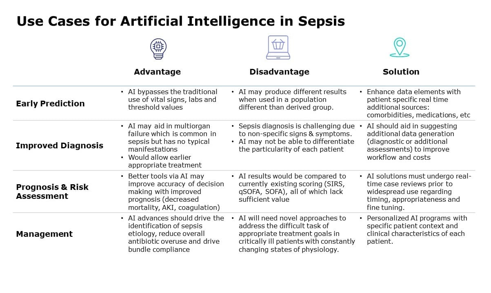

# Building AI Ready Leadership

## Building AI-Ready Leadership

Successful implementation of AI in any organization is driven from the top by the actions, examples and visions that come from those in leadership roles

The onus is on the leadership and senior management in companies and other organizations to proactively drive transformation, address challenges, and cultivate a culture that supports AI adoption.

## The Role of Leadership in AI Adoption

- AI implementation is not just a technology issue — it’s a leadership and strategic issue that involves all aspects of the organization
- Healthcare leaders start by setting the vision, strategy, and mangement framework for AI adoption
- Management has to get buy-in from the staff on the proposed changes
- Responsible for the planning the change management process
- Leadership leads the organization's cultural transformation from "the way we did things" to "the new way of doing things"
- The same leadership issues and change management challenges have to be addressed with AI as with introducing computerization, for example

## Case Study: Mayo Clinic’s AI Leadership Model

Mayo Clinic needed to implement AI for early disease detection and personalized medicine but faced organizational resistance and unclear governance structures.

Leadership Action:
- The hospital created an AI Governance Board, comprising executives, clinicians, and data scientists, to oversee AI implementation.
- This allowed buy-in from stakeholders so that people felt they were part of the process rather than being powerless bystanders
- Stakeholders were able to provide input and feedback on issues that might affect the change process that management might not have been aware
- The resulting change management process was both practical and doable  
- [AI leadership challenges: Five key questions](https://www.mayoclinicplatform.org/link/ai-leadership-challenges-five-key-questions/)

Outcomes
- Established clear AI ethics and governance policies.
- Developed explainable AI models to support clinical decision-making.
- Built staff training programs to increase AI literacy.
- Leadership Lesson: Strong leadership commitment and proactive management based on stakeholder input are key to overcoming resistance.

## Developing an AI Strategy 

The AI strategy focuses on how AI will be implemented in the organization
- It should be aligned with an organization’s mission, values, and patient care goals.
- People should be able to see how it helps them do their jobs better rather than hinder them
- It must balance innovation, compliance, financial investment, and workforce readiness.
- There are multiple stakeholder groups whose requirements have to be balanced
- Leaders should start with AI use cases that offer quick wins and demonstrate value while providing feedback on challenges encountered
- Small scale pilot programs allow for immediate low-cost feedback on what is working and what is not.

## Case Study: Cleveland Clinic’s AI Strategy for Personalized Care

Cleveland Clinic wanted to use AI for predictive patient risk assessments but lacked a defined strategy for AI implementation.

Leadership Action:
- Focused AI efforts on the specific problem area of personalized patient care models.
- Partnered with AI startups and research institutions to co-develop predictive analytics for chronic disease management.
- [How AI Is Being Used to Benefit Your Healthcare](https://health.clevelandclinic.org/ai-in-healthcare)

Outcomes
- AI-driven predictive analytics improved patient outcomes by 30%.
- Developed a scalable AI framework applicable across different medical fields.
- Leadership Lesson: AI initiatives must have a clear strategy with measurable goals and incremental implementation steps.

## Building an AI-Ready Culture

 Healthcare professionals often fear AI will replace their jobs
 - The AI needs to be seen as an enabler, not a disruptor.
 - Management needs to support a corporate culture that embraces innovation, experimentation, and data-driven decision-making.
 - AI should be integrated into daily workflows to provide operational improvements, not imposed as an external force.
 - A clear understanding of the AI being deployed needs to be developed among those who will be using it or working with it - the technology needs to be "de-mystified"
 - This includes clear guidelines on what the AI can do and what it cannot do

## Case Study: Kaiser Permanente’s AI Workforce Readiness Program

Employees resisted AI tools due to lack of trust and concerns over job displacement

Leadership Action:
- Created an AI Education Program for clinical and administrative staff
- Involved doctors and nurses in AI development to ensure solutions were clinically relevant and relatable to their professional experience
- Used AI champions (early adopters) to drive AI acceptance among their peers

-[A Case Study of Integrating Technology and Work Systems at Kaiser Permanente’s Health Hubs](https://workofthefuture-taskforce.mit.edu/research-post/a-case-study-of-integrating-technology-and-work-systems-at-kaiser-permanentes-health-hubs/)

Outcomes
- Increased AI adoption rate by 40% in the first year.
- Created trust between AI developers and healthcare practitioners.
- Leadership Lesson: Cultural transformation and AI education are essential for workforce buy-in.

## Workforce Readiness & AI Upskilling

AI is often a new and intimidating technology that may be difficult for staff to immediately understand and use.
- AI adoption requires reskilling and upskilling of healthcare professionals.
  - Reskilling prepares current workers for different roles if their current responsibility is to be downsized
  - Upskilling enhances an employee’s existing abilities by teaching them new tricks of the trade
- Leaders must invest in AI training programs to prepare employees for new AI-powered workflows.
- AI education should cover data literacy, bias mitigation, and ethical AI principles.

## Case Study: Mount Sinai’s AI Training for Medical Staff

Doctors and nurses at Mount Sinai Hospital lacked AI literacy, leading to low adoption rates of AI-powered clinical decision support tools.

Leadership Actions
- Developed a custom AI training curriculum for medical staff.
- Integrated AI learning modules into continuing medical education (CME).
- Hosted AI boot camps for physicians, nurses, and hospital administrators.
- [Mount Sinai Launches Department of Artificial Intelligence and Human Health](https://www.mountsinai.org/about/newsroom/2021/mount-sinai-launches-department-of-artificial-intelligence-and-human-health)

Outcomes
- 75% increase in AI literacy among medical staff.
- AI-powered early warning systems reduced preventable ICU admissions by 20%.
- Leadership Lesson: Investing in AI education improves adoption, efficiency, and patient care quality.

## Ethical Leadership in AI

AI can reinforce biases, compromise patient privacy, and create ethical dilemmas if not properly governed.
- Ethical AI leadership requires fairness, explainability, and patient-centered AI governance.
- Leaders must establish clear guidelines for AI accountability.

## Case Study: Stanford Health’s AI Ethics Framework

AI models used in predicting heart disease showed racial and gender biases.

Leadership Actions
- Established an AI Ethics Committee to review and audit AI models before deployment.
- Implemented bias-detection protocols for AI-driven diagnoses.
- Introduced transparency policies, ensuring AI-generated recommendations were explainable.
- [Making AI Work for Health Care: Stanford’s Framework Evaluates Impact](https://hai.stanford.edu/news/making-ai-work-health-care-stanfords-framework-evaluates-impact)
- [Stanford's Elements of Ethics and Compliance](https://uco.stanford.edu/seven-elements-ethics-and-compliance-excellence)

Outcomes
- Reduced racial disparities in heart disease predictions by 30%.
- Increased trust among physicians and patients in AI-driven diagnostics.
- Leadership Lesson: Ethical leadership ensures AI fairness, bias reduction, and transparency.

## Summary

How to Build AI-Ready Leadership in Healthcare
- AI adoption is a leadership challenge, not just a technology challenge.
- Strategic planning and AI governance are essential for successful AI integration.
- Workforce training and AI literacy drive AI adoption.
- AI must enhance, not replace, human expertise.
- Ethical AI leadership ensures fairness, transparency, and trust.

## Collaboration and Innovation

- AI innovation in healthcare involves finding new ways to use new technology to solve existing problems
- This often requires cross-disciplinary collaboration based in a culture of experimentation, and strong leadership. 
- Collaboration can occur with any organization or group of stakeholders either internal or external to the organization

## AI and Digital Transformation in Healthcare

- AI is driving a paradigm shift in healthcare with the use of predictive analytics, personalized medicine, and administrative automation.
- Responding to this shift requires leadership to drive cultural shifts, and cross-functional collaboration.
- Successful AI innovation balances clinical effectiveness, operational efficiency, and regulatory compliance.

## Case Study: Johns Hopkins’ AI-Driven ICU Monitoring

ICU doctors needed a real-time AI-powered monitoring system to detect patient deterioration early.

Actions Taken:
- Developed an AI system that continuously analyzes vital signs to detect early warning signs of complications.
- Collaborated with clinicians, data scientists, and IT teams to integrate AI into existing hospital workflows.
- [Johns Hopkins Physicians and Engineers Search for AI Program That Accurately Predicts Risk of ‘ICU Delirium’](https://www.hopkinsmedicine.org/news/newsroom/news-releases/2023/01/johns-hopkins-physicians-and-engineers-search-for-ai-program-that-accurately-predicts-risk-of-icu-delirium)

Outcomes
- Reduced ICU mortality rates by 20%.
- Improved response time to critical conditions.
- Innovation Lesson: AI should be integrated into existing clinical workflows, not disrupt them.

## Collaborating with AI Vendors & Startups

- AI adoption in healthcare often requires collaboration with technology vendors, research institutions, and startups.
- Hospitals must ensure AI vendors align with ethical, regulatory, and clinical standards.
- Successful collaborations require clear contracts, pilot testing, and outcome-driven KPIs.

## Case Study: Microsoft & Novartis AI Partnership

Novartis needed AI-driven drug discovery models but lacked in-house AI expertise.

Actions Taken
- Partnered with Microsoft to co-develop AI solutions for drug development and patient insights.
- Used machine learning models to predict drug efficacy and optimize clinical trials.
- [Novartis and Microsoft work to reinvent treatment discovery and development](https://blogs.microsoft.com/blog/2019/10/01/bringing-together-deep-bioscience-and-ai-to-help-patients-worldwide-novartis-and-microsoft-work-to-reinvent-treatment-discovery-and-development/)

Outcome
- Reduced drug development timelines by 30%.
- Improved precision in developing personalized treatment plans.
- Innovation Lesson: Healthcare institutions should leverage AI vendors' technical expertise while ensuring medical and ethical oversight.

## Cross-Departmental AI Implementation

- AI success depends on breaking down silos between departments (IT, clinical, operations, finance).
- AI initiatives require multidisciplinary teams of physicians, engineers, data scientists, and administrators.
- Change management is critical—leaders must align AI with institutional goals and ensure staff buy-in.

## Case Study: UCLA Health’s AI-Powered Radiology Initiative

UCLA radiologists needed AI-assisted imaging tools but feared AI would replace their expertise with models that would produce substandard results

Actions Taken
- Engaged radiologists in AI model development to ensure clinical relevance.
- Trained IT and radiology teams together to facilitate adoption.
- [New AI model efficiently reaches clinical-expert-level accuracy in complex medical scans](https://www.uclahealth.org/news/release/new-ai-model-efficiently-reaches-clinical-expert-level)
    

Outcomes:
- Increased AI accuracy in detecting anomalies by 25%.
- Built trust in AI as a tool to support, not replace, doctors.
- Innovation Lesson: Interdepartmental collaboration ensures AI meets clinical needs and gains user trust.

##  Funding and Investment in AI Healthcare Projects

- Implementing AI in healthcare requires significant investment in R&D, infrastructure, and workforce training.
- Leaders must assess ROI, cost-benefit analysis, and long-term AI sustainability and identify areas where they do not have the resources to do specific AI projects and need to look for alternate funding.
- Funding sources include government grants, venture capital, and hospital innovation funds.

## Case Study: Mayo Clinic’s AI Venture Fund

The Mayo Clinic needed continuous funding to develop new AI-driven medical technologies.

Actions Taken
- Created a dedicated AI Venture Fund to invest in early-stage AI healthcare startups.
- Established partnerships with tech investors to support AI research.
- [Mayo Clinic Funding Programs](https://businessdevelopment.mayoclinic.org/resources/funding-programs/)

Outcomes
- Raised $50 million in AI innovation funding.
- Launched multiple AI-powered healthcare startups.
- Innovation Lesson: Hospitals and healthcare institutions can accelerate AI innovation by strategically investing in AI-focused startups.

## Summary

- AI innovation requires a structured approach, not just experimentation. 
- Cross-functional collaboration is essential for AI success.
- Partnerships with AI vendors, startups, and public agencies drive scale.
- Trust-building through training and involvement of medical professionals is crucial.
- Sustainable AI innovation needs dedicated funding and strategic investment.

## Leadership Strategies for AI Implementation in Healthcare

- Implementing AI in healthcare requires strong leadership, strategic planning, and cross-functional coordination. 
- Leaders must ensure AI adoption aligns with clinical and operational goals, ethical considerations, and workforce readiness. 

## Leading AI Implementation in a Hospital or Healthcare System

- AI implementation should align with hospital priorities, such as improving patient care, reducing costs, or increasing efficiency.
- Leaders must ensure clear governance structures, assigning AI responsibility to key teams.
- AI adoption should be phased—starting with small-scale pilots before full deployment.

## Case Study: Stanford Health’s AI-Driven Patient Triage System

Emergency departments (ED) struggled with patient overload and slow triage times.

Leadership Strategy:
- Introduced AI-powered triage to prioritize critical cases using machine learning.
- Developed a phased rollout strategy across different departments to monitor impact. 
- [AI-Powered Triage: Revolutionizing Acute Hospital Care for Better Patient Outcomes](https://www.idataacumen.com/blog/ai-powered-triage-revolutionizing-acute-hospital-care)

Outcome:
- Reduced ED wait times by 35%.
- Improved patient satisfaction scores.
- Leadership Lesson: AI implementation must be incremental, measurable, and aligned with hospital priorities.

## Change Management for AI Adoption

- AI implementation often faces resistance which leaders must actively manage in order to remove it as an obstacle to change
- Communication is key — staff must understand why AI is being introduced and how it benefits them.
- Leadership should create AI adoption champions — early adopters who help train and encourage peers.

## Case Study: Mount Sinai’s AI-Driven Workflow Automation

Hospital staff resisted AI-driven administrative automation, fearing job displacement.

Leadership Strategy:
- Introduced AI as a tool for reducing workload, not replacing employees.
- Provided training programs and showcased time savings as AI automated routine tasks.
- [Nursing and AI: Augmented Intelligence](https://health.mountsinai.org/blog/nursing-and-ai-augmented-intelligence/)

Outcomes:
- Increased acceptance of AI tools among hospital staff.
- Reduced administrative workload by 40%, allowing more focus on patient care.
- Leadership Lesson: AI change management should focus on education, reassurance, and tangible benefits.

## Measuring AI Success in Healthcare

- AI projects must have defined success metrics (e.g., accuracy, efficiency, patient outcomes).
- Leaders should implement Key Performance Indicators (KPIs) before and after AI deployment.
- AI effectiveness should be measured not just by performance metrics but also by workforce adoption and patient satisfaction, measures that are actively elicited by management

## Case Study: Cleveland Clinic’s AI-Powered Administrative Automation

The Clinic needed a way to measure AI's impact on efficiency.

Leadership Strategy:
- Set clear KPIs, including reduction in appointment scheduling errors and improved response times.
- Automate tasks with AI that took time away from patient interactions
- Conducted pre- and post-implementation comparisons to assess AI's effectiveness.
- [Nursing Teams Leverage Automation to Improve Workflows, Devote More Time to Patient Care](https://consultqd.clevelandclinic.org/nursing-teams-leverage-automation-to-improve-workflows-devote-more-time-to-patient-care)

Outcomes
- AI-driven scheduling reduced appointment errors by 60%.
- Call center response times improved by 30%, enhancing patient experience.
- Leadership Lesson: AI success should be quantifiable, aligned with business goals, and continuously monitored.

## Managing AI Risks & Failures

- AI systems can fail, introduce bias, or cause unintended harm
- Risk management requires regular AI audits, error tracking, and contingency planning.
- AI failures should be investigated transparently, with clear accountability and corrective actions.

## Case Study: University of Pennsylvania’s AI Sepsis Model

To contrast Epic’s failure, the University of Pennsylvania successfully developed an AI sepsis detection system

Leadership Strategy:
- Used transparent AI models that clinicians could understand and validate.
- Allowed feedback on the quality of the model output
- Tested models on real patient data before hospital-wide deployment.
- Had physician oversight, ensuring AI complemented clinical expertise rather than replacing it.
- [Penn leverages machine learning to identify severe sepsis early](https://www.healthdatamanagement.com/articles/penn-leverages-machine-learning-to-identify-severe-sepsis-early)

Outcomes
- The AI system correctly identified 85% of sepsis cases and improved survival rates.

## Future-Proofing AI in Healthcare

- AI technology evolves rapidly
- leaders must ensure long-term AI adaptability and not get stuck with obsolete technology
- Future-proofing requires investment in AI literacy, continuous learning, and scalable AI infrastructure.
- Leaders must ensure AI compliance with evolving regulations and ethical guidelines.
- Also requires keeping track of improvements in the AI tools they are using and being open to new tools as they are developed and introduced into the field

## Case Study: Google’s AI-Driven Medical Imaging – Future-Proofing Through Adaptive AI

Google’s dermatology AI struggled with bias due to narrow training datasets.

Leadership Strategy:

- Adopted a continuous AI learning approach - expanding datasets to include diverse patient populations.
- Implemented ongoing bias audits
- Incorporated model improvements as they became available.
- [Medical Imaging Suite](https://cloud.google.com/medical-imaging)

Outcome:
- Improved AI’s accuracy across different skin tones.
- Set a new industry standard for AI fairness and adaptability.
- Leadership Lesson: AI should be continuously updated, audited, and improved to remain relevant and fair.

## Summary 

- AI adoption must align with organizational goals, not just be a standalone initiative.
- Phased rollouts and measurable success indicators are critical.
- Change management and workforce engagement ensure AI acceptance.
- Risk mitigation requires continuous AI monitoring and human oversight.
- Future-proofing AI ensures long-term impact and compliance.