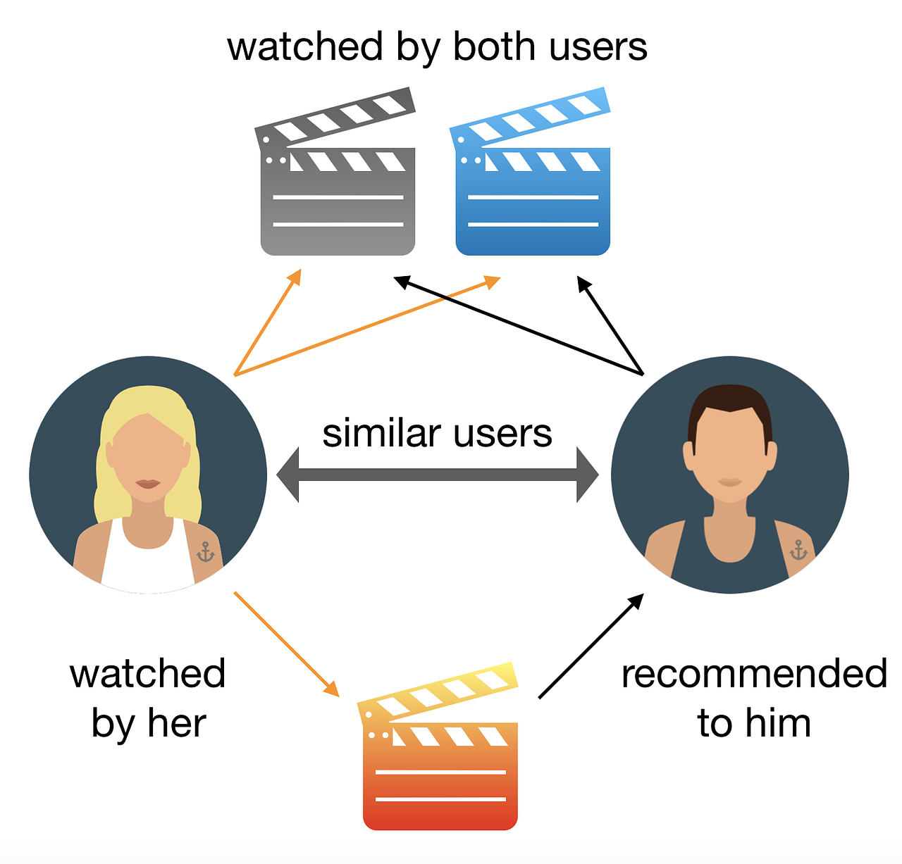
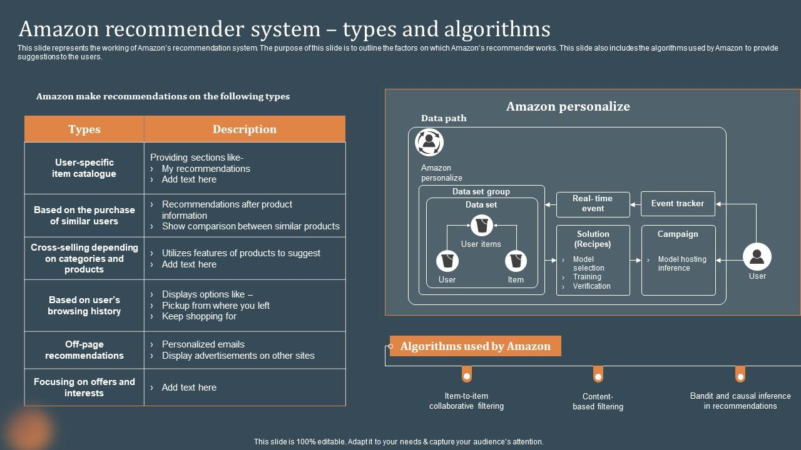
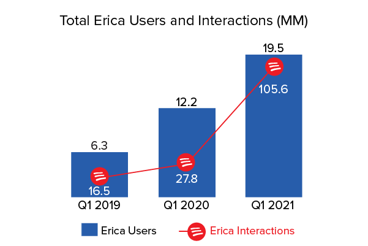
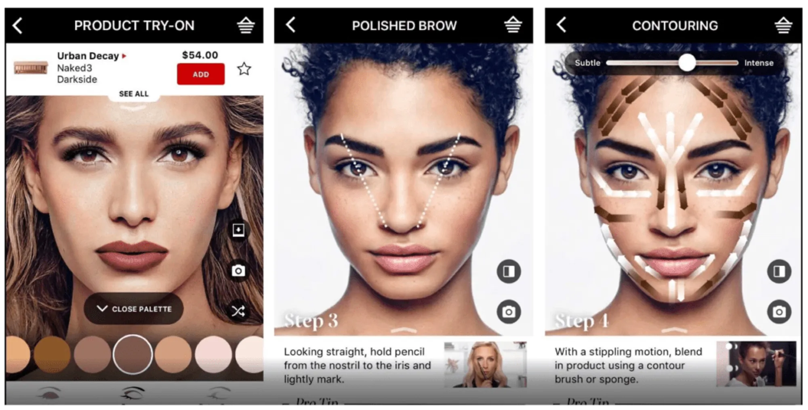
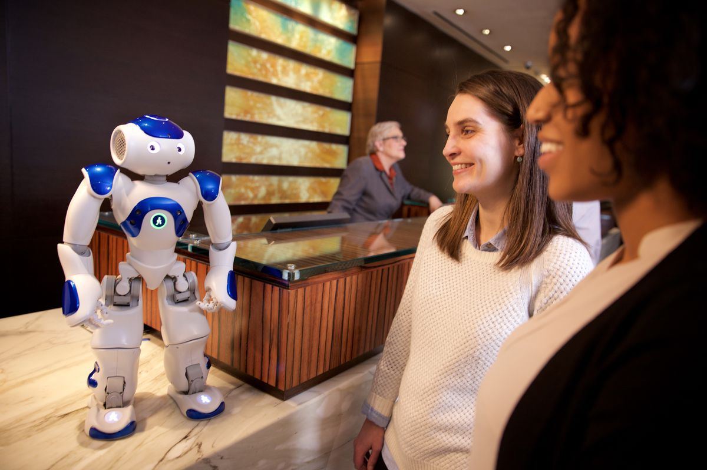
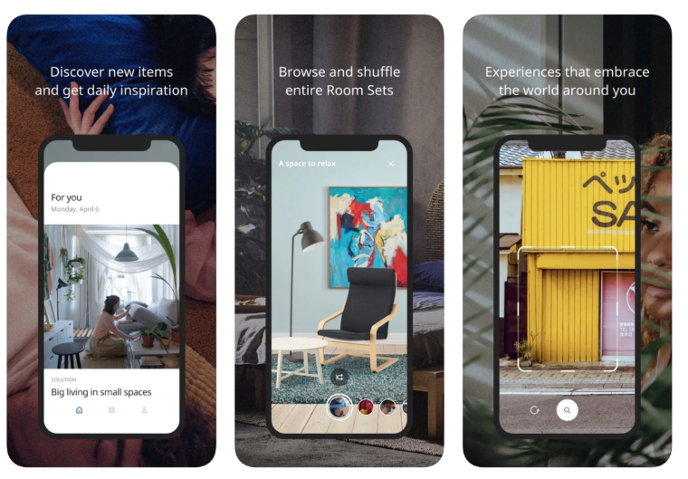
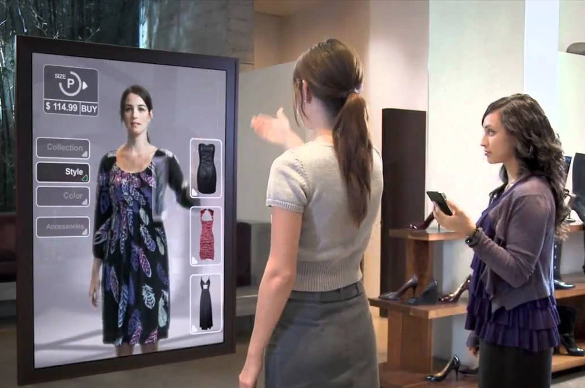

## Customer Experience

Customer Experience (CX) refers to the overall perception that a customer develops of a company based on interactions across all points of contact with the company

A point of contact, often called a "moment of truth" or a "touchpoint," is any interaction between the customer and any aspect of the company such as
- Perceptions of marketing campaigns and the sales process
- Customer support and responsiveness to customer inquiries
- Satisfaction with and ease of use of the product or service
- Proactive actions by the company to meet future customer needs

## Importance of CX

- Increases customer loyalty and retention
- Enhances brand reputation and market differentiation
- Boosts customer lifetime value (CLV)
- Drives positive word-of-mouth and referrals

## Key Components of CX

- _Customer Journey Mapping_ – Identification and optimization of each touchpoint in the customer's experience with the company over time
- _Omnichannel Experience_ – Ensuring consistency across different channels of contact like the company website, social media, physical stores and apps
- _Personalization_ – Tailoring the CX to individual customer preferences
- _Customer Support & Service_ – Providing efficient and responsive customer service through multiple support channels that support the customer preference; for example,  phone, live chat with a human, email, AI chatbots
- _Ease of Use (Usability & Accessibility)_ – Designing intuitive and user-friendly interfaces for websites, apps, and services.
- _Emotion & Satisfaction_ – Measuring and improving customer satisfaction, loyalty, and emotional connection to the brand.

## Challenges of Traditional CX

- The amount of effort required to personalize the touchpoints and being consistent in the CX has been a major challenge for companies
- In theory, it's a great idea, but in practice, it's very difficult and expensive to implement
- According to Forbes, CX efforts routinely struggle with:
  - Long wait times, either on hold or navigating IVR systems
  - Repetitive information requests, where the customer must provide the same details multiple times
  - Multiple transfers between agents or departments before reaching a resolution
  - A lack of consistency in service, resulting in varied outcomes depending on the agent or system involved

## How AI Personalizes CX

Using customer data on based on behavior, preferences, and past interactions, and being able to compare a customer's preferences to other similar customers allows for highly personalized interactions

Netflix & Spotify
- AI tools analyze user behavior to recommend movies, TV shows, and music
- Machine learning is used to suggest content based on user preferences.
- [How Netflix’s Recommendations System Works](https://help.netflix.com/en/node/100639)

Amazon & eBay
- Machine learning models are used to make product recommendations based on purchase history, browsing behavior, and customer reviews.
- Increases sales and customer satisfaction by suggesting relevant products based on what products are usually bought to together.
- [Amazon Product Recommendation System: How Does Amazon Algorithm Work?](https://stratoflow.com/amazon-recommendation-system/)

## AI Personal Assistants

Using chatbots and other interactive tools allow for individualized assistance at a large scale and 24/7 responsiveness to queries and help requests

Bank of America (Erica)
- AI-powered chatbot "Erica" helps customers check account balances, track spending, and make payments
- Uses natural language processing (NLP) to understand and respond conversationally.
- [AI Case Study Saturday: Customer Service Automation - Bank of America](https://www.linkedin.com/pulse/ai-case-study-saturday-customer-service-automation-alastair-9igte/)

Sephora AI Chatbot
- Provides beauty recommendations and allows customers to try on makeup virtually using AI-powered image recognition.
- Enhances the online shopping experience by personalizing product choices.
- [Beauty and the Bot: How Sephora Reimagined Customer Experience with AI](https://medium.com/cut-the-saas/beauty-and-the-bot-how-sephora-reimagined-customer-experience-with-ai-bafb5a9ae1d8)

## AI in Customer Support & Sentiment Analysis

Improves customer service by analyzing customer feedback, predicting complaints, and automating responses 

Sentiment Analysis (Coca-Cola, Delta Airlines, etc.)
- AI scans social media, emails, and customer reviews to gauge sentiment (positive, neutral, negative).
- Helps brands proactively address negative feedback and enhance service quality.
- -[Airline-Customer-Reviews-Sentiment-Analysis-for-Delta-Airlines](https://github.com/AYamdagni/Customer-Reviews-Sentiment-Analysis)

IBM Watson in Customer Support (Hilton Hotels – "Connie")
- AI-powered concierge named "Connie" answers customer inquiries in hotels, providing recommendations and booking assistance.
- Uses machine learning to improve responses over time using sentiment analysis.
- [Hilton and IBM built a Watson-powered concierge robot](https://www.theverge.com/2016/3/9/11180418/hilton-ibm-connie-robot-watson-hotel-concierge)

## Augmented Reality (AR) & Virtual Reality (VR)

AI enhances interactive shopping experiences using AR/VR.

IKEA Place App
- AI-powered AR app allows customers to see how furniture looks in their home before purchasing.
- [How The Ikea Place App Let's You Decorate Virtually](https://www.housedigest.com/1131887/how-the-ikea-place-app-lets-you-decorate-virtually/)

WalMart Virtual Mirror
- Allows customers to see how clothing looks on them without trying it on physically or needing to go to a store.
- [Walmart Rolls Out Virtual Clothing Try-On Technology for Online Shoppers](https://www.technologistan.pk/walmart-rolls-out-virtual-clothing-try-on-technology-for-online-shoppers/)

