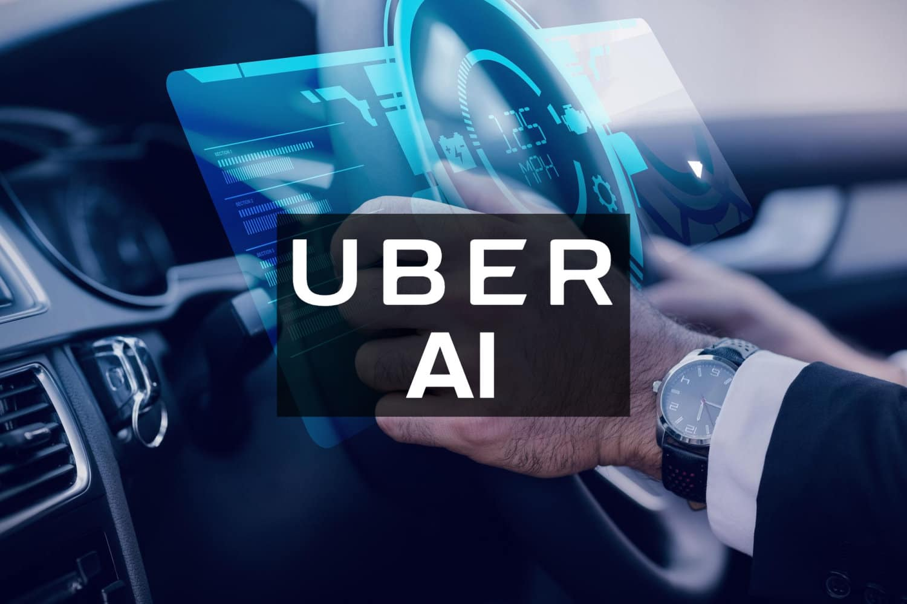

# Data-Driven Decision-Making

## AI-Driven Business Intelligence 

 - AI-Driven Business Intelligence (BI) supports faster, data-backed decisions
 - It analyzes large datasets and presents insights in real-time dashboards or reports.
 - Unlike traditional BI, AI-powered tools continuously learn and adapt to new data trends
 - This produces proactive insights rather than reactive reports. 
 - Some use cases
   - Detect market shifts and emerging trends.
   - Identify operational inefficiencies and cost-saving opportunities.
   - Optimize real-time decision-making based on live data feeds.

## Case Study: Amazon’s AI-Powered Supply Chain Optimization

Amazon needed to predict inventory demands and shipping logistics across global markets.

Solution
-  Developed an AI-powered predictive inventory management system that analyzed:
  - Customer purchase patterns (seasonal trends, regional demand).
  - Supplier performance and delays.
  - Warehouse stock levels to reduce overstocking or shortages
  - [Case Study: Amazon’s AI-Driven Supply Chain: A Blueprint for the Future of Global Logistics](https://cdotimes.com/2024/08/23/case-study-amazons-ai-driven-supply-chain-a-blueprint-for-the-future-of-global-logistics/)

Outcomes
- Reduced delivery times by 30%.
- Increased warehouse efficiency, reducing holding costs.
- Improved customer satisfaction through faster shipping.
- Leadership Lesson: AI-driven BI allows executives to proactively act in real-time, ensuring supply chain resilience.

## Predictive Analytics for Business Growth

Uses historical data, machine learning, and statistical models to predict future trends and business outcomes such as:
- Forecast sales revenue and customer demand.
- Predict market fluctuations and competitor movements.
- Identify early warning signs of business risks (e.g., customer churn, supply chain disruptions).

## Case Study: Goldman Sachs' AI-Driven Financial Risk Management

Goldman Sachs needed an AI system to predict stock market movements and minimize investment risks.

Solution:
- Implemented machine learning models to analyze financial trends.
- Used real-time AI monitoring to detect economic downturn warning signs.
- Developed automated risk alerts for investment advisors.
- [Goldman Sachs: Pioneering AI Integration in Innovative Financial Technologies](https://imprasoft.com/goldman-sachs-pioneering-ai-integration-in-innovative-financial-technologies/)
    

Outcomes
- 25% reduction in financial risks associated with market volatility.
- Faster, data-driven investment decisions.
- Increased client portfolio profitability through AI-optimized strategies.
- Leadership Lesson: AI-powered predictive analytics gives executives a competitive edge in financial decision-making.

## AI and Executive Decision Support Systems (DSS)

AI-powered DSS tools automate and enhance decision-making by processing complex datasets and recommending optimal courses of action. For example:
- Scenario simulation – AI models can test multiple business strategies before implementation.
- Automated alerts – AI continuously monitors market conditions and sends real-time recommendations.
- Data-driven corporate governance – AI helps align decisions with compliance regulations.

## Case Study: Google’s AI-Enabled Decision Support for Marketing Strategies

Google’s marketing executives needed AI-driven insights to optimize digital ad spending and maximize ROI.

Solution:
- Implemented an AI-powered DSS
- Analyzed ad performance across multiple platforms.
- Suggested optimal budget allocation based on historical data.
- Provided real-time adjustments to maximize conversion rates.
- [Help your marketing go further, faster, with AI-powered ad solutions](https://ads.google.com/intl/en_ca/home/campaigns/ai-powered-ad-solutions/)
  
Outcomes
- Increased advertising efficiency by 35%.
- Reduced marketing costs by 20% through AI-driven optimizations.
- Leadership Lesson: AI-powered DSS helps executives make fast, data-backed marketing decisions, ensuring maximum profitability.

## Risk Management and AI

- AI  can be used to identify and reduces business risks. For example:
- Detects fraudulent activities using anomaly detection.
- Predicts market instability and financial risks.
- Automates regulatory compliance tracking.
- Track cybersecurity threats in real-time.
- Models for predictive fraud detection in financial transactions.
- AI-driven crisis response planning to mitigate supply chain risks.

## Case Study: PayPal’s AI Fraud Detection System

PayPal needed to prevent fraudulent transactions without disrupting legitimate payments.

Solution
- Developed an AI model that analyzed millions of transactions per second.
    Used deep learning to detect patterns in fraudulent behavior.
- Implemented real-time fraud prevention alerts for high-risk transactions.
- [Harnessing machine learning fraud detection technologies](https://www.paypal.com/us/brc/article/payment-fraud-detection-machine-learning)

Outcomes:
- Fraud detection accuracy improved by 85%.
- Reduced false positives, ensuring smoother transactions.
- Strengthened customer trust and financial security.
- Leadership Lesson: AI can automate risk detection and prevention, improving security and compliance in executive decision-making.

## Summary

- AI-driven business intelligence enables real-time insights for executives.
- Predictive analytics helps leaders anticipate market trends and drive growth.
- AI-powered decision support systems enhance strategic decision-making.
- AI reduces business risks by automating fraud detection and crisis prediction.
- AI allows executives to focus on high-impact decisions, rather than manual data analysis.

## Ensuring Data Accuracy & Integrity

Poor-quality data leads to incorrect AI insights, operational inefficiencies, and costly errors.

Dimensions of Data Quality:
- Accuracy – Data should reflect real-world conditions.
- Completeness – No missing values or incomplete records.
- Consistency – Data should be uniform across systems.
- Timeliness – Data should be up to date and accessible when needed.

How Executives Can Ensure Data Accuracy:
- Implement automated AI-driven data validation checks.
- Enforce standardized data collection policies across departments.
- Conduct routine audits and cleansing of enterprise data.

## Case Study: Uber’s AI-Driven Data Integrity Management

Uber needed real-time, accurate ride data to optimize driver allocation and pricing.

Data Management Strategy:
- Implemented AI-powered data cleansing algorithms to detect duplicate, outdated, or conflicting data.
- Used machine learning to cross-verify ride completion data across multiple sources.
- [Uber knows you: how data optimizes our rides](https://d3.harvard.edu/platform-digit/submission/uber-knows-you-how-data-optimizes-our-rides/)

Outcomes
- Increased real-time ride price accuracy by 40%.
- Improved rider-driver matching efficiency, reducing cancellations.
- Leadership Lesson: AI-driven data verification ensures real-time accuracy for mission-critical business functions.

## Overcoming Data Silos in Organizations

Data Silos are isolated clusters of data across different departments that prevent seamless AI integration. Problems with silos:
- Marketing, sales, and operations may use different datasets, leading to inconsistent insights.
- AI models fail to provide a holistic business view if they only have access to fragmented data.

Breaking down data silos
- Implement enterprise-wide AI-driven data integration platforms
- Foster cross-departmental collaboration on data governance.
- Establish centralized data warehouses or data lakes.

## Case Study: General Electric’s (GE) AI-Powered Data Integration for Industrial Analytics

GE's industrial divisions (aviation, healthcare, power) used disconnected legacy data systems, preventing efficient AI-driven insights.

Integration Strategy:
- Implemented AI-based data harmonization to unify machine sensor data across business units.
- Adopted cloud-based AI data lakes to consolidate data from multiple departments.
- [General Electric Digital Develops Predictive Analytics Suite](https://manufacturingdigital.com/smart-manufacturing/general-electric-digital-develops-predictive-analytics-suite)

Outcomes
- Reduced machine downtime by 25% through real-time AI-driven predictive maintenance.
- Improved cross-functional operational decision-making.
- Leadership Lesson: Breaking down data silos improves AI accuracy and operational efficiency.

## AI for Data Cleaning & Management

Data Cleaning with AI detects errors, duplicates, and inconsistencies in datasets and automatically corrects them. Benefits are:
- Reduces manual work – AI automates data validation and corrections.
- Prevents decision-making errors – Clean data ensures trustworthy AI outputs.
- Speeds up data processing – AI optimizes real-time analytics performance.
- Some way AI cleans data
  - Detects missing values and fills gaps with machine learning predictions.
  - Identifies duplicate entries and merges them into a single source of truth.
  - Finds outliers and anomalies to prevent data distortion in AI models.

## Case Study: Netflix’s AI-Powered Data Cleaning for Content Recommendations

Netflix’s recommendation engine suffered from incomplete and inconsistent viewing data, leading to inaccurate suggestions.

Data Management Strategy:
- Deployed AI-driven anomaly detection to spot incorrect metadata.
- Used deep learning models to reconstruct missing user preference data.
- [Netflix Case Study: Unveiling the Data-Driven Strategies Behind the Streaming Giant](https://www.33rdsquare.com/netflix-case-study-eda-unveiling-data-driven-strategies-for-streaming/)

Outcomes:
- Increased user engagement by 28% due to improved recommendations.
- Reduced incorrect movie suggestions, leading to higher customer satisfaction.
- Leadership Lesson: AI-powered data cleaning ensures high-quality, reliable inputs for AI decision-making.

## Data Governance & Compliance

Data Governance is a framework for ensuring data security, privacy, and compliance across an organization. 

Key Data Compliance Regulations for AI Executives:
- GDPR (General Data Protection Regulation) – Governs data privacy in the EU.
- CCPA (California Consumer Privacy Act) – U.S. privacy law for consumer data protection.
- HIPAA (Health Insurance Portability and Accountability Act) – Ensures healthcare data security.

AI's Role in Compliance & Data Protection:
- Automated privacy risk detection – AI flags potential data breaches.
- AI-driven access control – Ensures only authorized personnel can view sensitive data.
- Real-time compliance monitoring – AI scans systems for policy violations.

## Case Study: HSBC’s AI-Powered Compliance & Fraud Detection System

HSBC needed to ensure global compliance with financial data regulations and detect fraud.

AI Strategy:
- Deployed AI models to detect anomalies in financial transactions.
- Used real-time compliance monitoring AI to track policy violations.
- [Fighting money launderers with artificial intelligence at HSBC](https://cloud.google.com/blog/topics/financial-services/how-hsbc-fights-money-launderers-with-artificial-intelligence)

Outcomes:
- Reduced regulatory fines by 40% through proactive AI compliance.
- Detected fraudulent transactions with 90% accuracy.
- Leadership Lesson: AI helps executives automate regulatory compliance while enhancing data security.

## Summary

- AI is only as good as the data it processes—data quality must be a leadership priority.
- Breaking down data silos improves AI accuracy and decision-making.
- AI-powered data cleaning reduces errors and increases trust in AI analytics.
- Strong data governance ensures compliance with evolving regulations.

## AI Leadership and Data Strategy

A Data-Driven Culture is an organizational mindset where data is the foundation for all decision-making rather than intuition or experience alone.

How AI Transforms Leadership Decision-Making:
- AI provides real-time, predictive insights to drive strategy.
- AI enhances business agility by automating complex analyses.
- AI enables evidence-based decision-making at all levels.

Executive Leadership’s Role in Building a Data-Driven Culture:
- Establish AI and data governance policies.
- Foster cross-departmental collaboration on AI initiatives.
- Lead by example—using AI insights in strategic meetings.

## Case Study: Microsoft’s AI-Driven Workplace Transformation

Microsoft aimed to transition from opinion-based decision-making to a data-driven approach across all business units.

Leadership Strategy
- Implemented company-wide AI-driven dashboards for real-time decision support.
- Required executives to justify major decisions using data rather than intuition.
- Provided mandatory AI and data training for leadership teams.
- [Introducing the AI-Powered Workplace: Technology solutions for flexible work](https://techcommunity.microsoft.com/blog/microsoftteamsblog/introducing-the-ai-powered-workplace-technology-solutions-for-flexible-work/4296823)

   
Outcomes
- 50% faster decision-making due to improved data accessibility.
- Increased AI adoption across departments, aligning business units with AI strategy.
- Leadership Lesson: Executives must champion AI adoption and use data in their own decision-making to set the standard.

## Upskilling Teams for AI and Data Literacy

 AI and Data Literacy
 - Employees should be able to interpret AI insights, use data dashboards, and apply AI-driven recommendations in daily work.

Why Upskilling Matters:
- AI is only effective if employees know how to use it.
- Organizations with higher AI literacy have better adoption rates.

Strategies for AI Upskilling:
- Create custom AI training programs for different roles.
- Implement mandatory AI onboarding for new hires.
- Provide incentives for AI certifications and skill-building.

## Case Study: JPMorgan Chase’s AI Upskilling Initiative

JPMorgan’s workforce needed AI skills to leverage machine learning models for financial risk assessment.

Leadership Strategy:
- Developed an AI and Data Literacy Academy for employees.
- Provided internal certifications for AI-related skills.
- Encouraged peer-led AI workshops to foster collaboration.
- [How JPMorgan Chase is preparing the workforce for the future of AI](https://www.jpmorganchase.com/newsroom/stories/how-jpmc-is-preparing-workforce-for-ai)

Outcomes
- 60% increase in employee engagement with AI-powered decision tools.
- Reduced errors in risk assessment models by 35%.
- Leadership Lesson: AI adoption improves when employees are actively trained and incentivized to use AI tools.

## Measuring the ROI of AI Initiatives

How to Track AI Success:
- Operational Efficiency: AI’s impact on reducing costs and streamlining workflows.
- Revenue Growth: AI’s role in increasing sales, customer retention, or market expansion.
- Workforce Productivity: Measuring how AI improves employee performance.
- Customer Satisfaction: Analyzing AI’s effect on customer engagement and service quality.

AI Performance Metrics:
- Time saved on manual processes.
- Reduction in decision-making errors.
- Increase in data-driven decision adoption rates.

## Case Study: Coca-Cola’s AI-Powered Marketing Strategy

Coca-Cola wanted to measure AI’s impact on marketing personalization.

AI Strategy:
- Used AI to analyze customer preferences and predict trends.
- Automated real-time marketing campaign adjustments based on AI insights.
- [Generative AI Uncapped: Coca-Cola’s Creative Revolution](https://www.analyticsinsight.net/case-study/generative-ai-uncapped-coca-colas-creative-revolution)

    
Outcomes 
- Customer engagement increased by 35%.
- Ad conversion rates improved by 20%, leading to higher revenue.
- Leadership Lesson: AI’s success should be quantified with clear business KPIs to track ROI.

## Summary

- AI adoption starts at the top—leaders must set the example.
- Overcoming employee resistance is crucial for AI success.
- Investing in AI upskilling empowers employees to use AI effectively.
- Measuring AI ROI ensures long-term adoption and business value.