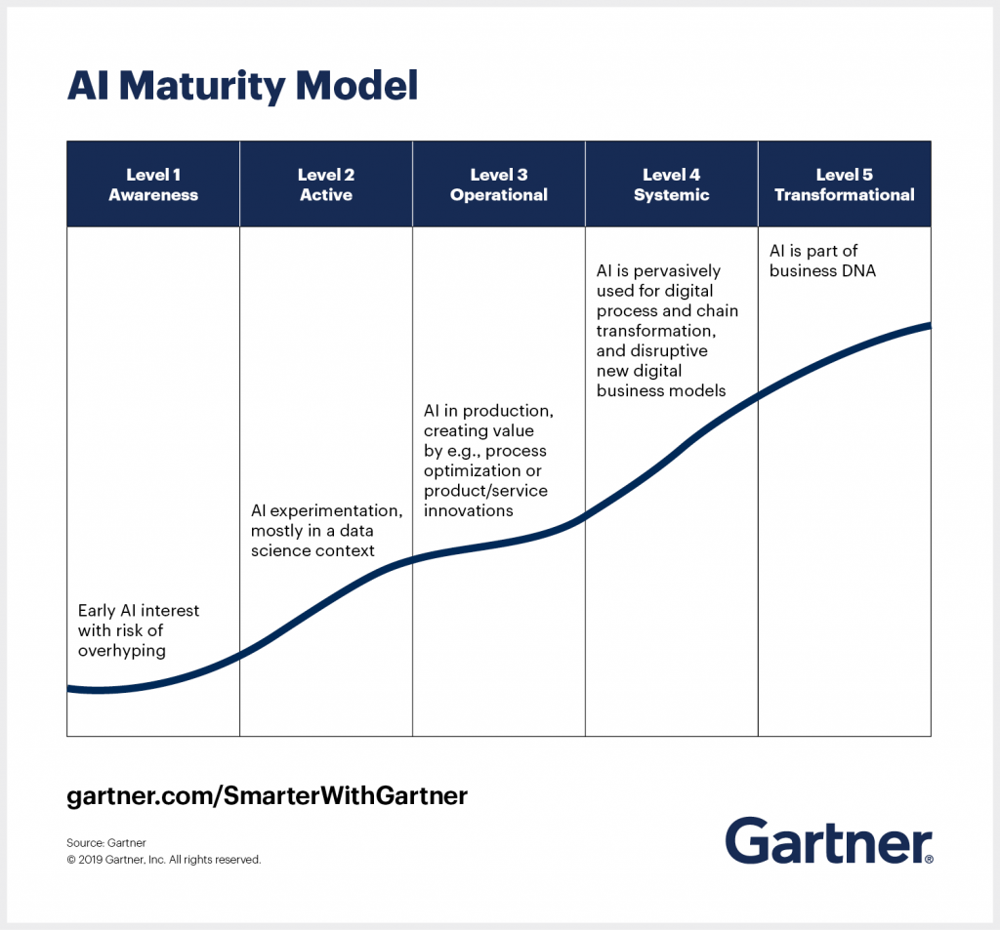
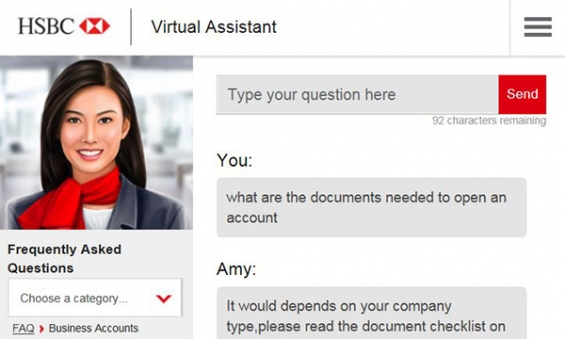
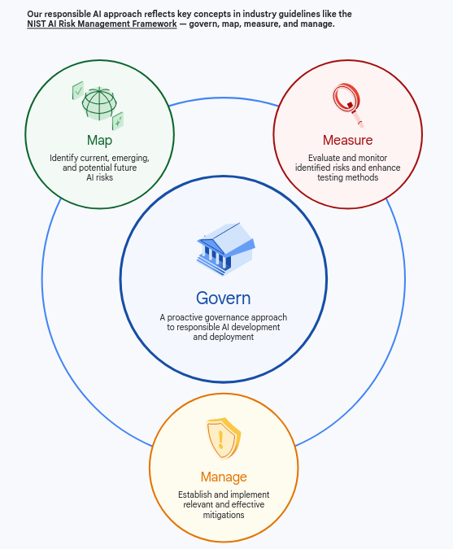
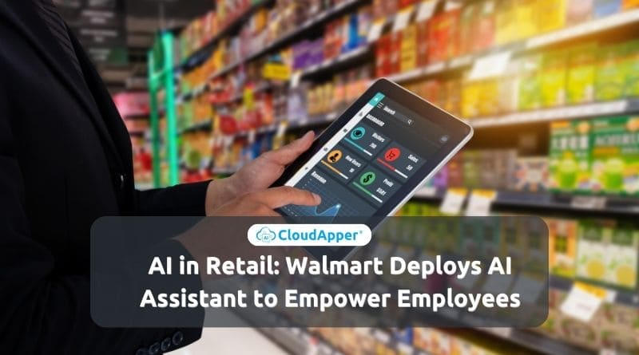
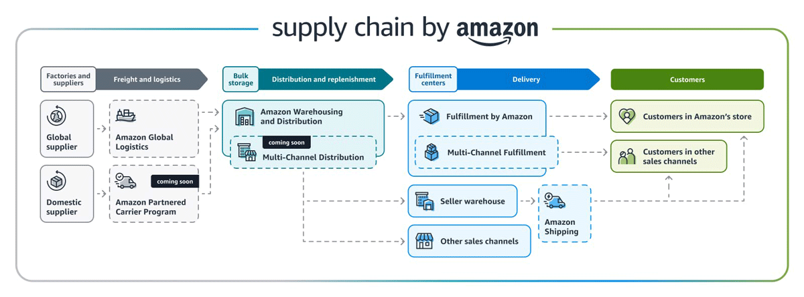
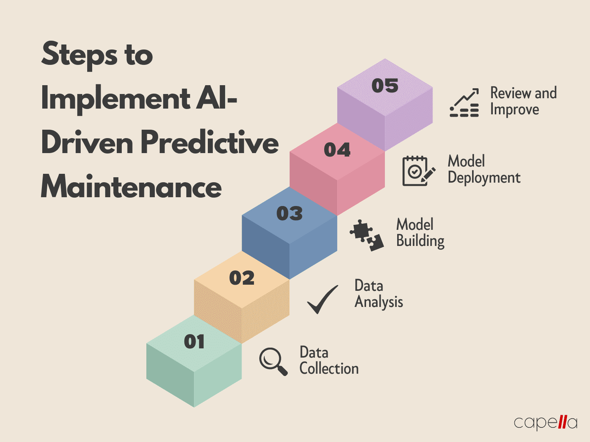
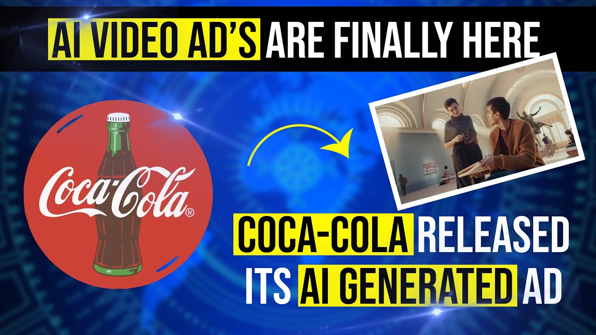

# Planning for AI Implementation

## Understanding AI Readiness

AI readiness is the ability of an organization to successfully adopt and scale AI.

AI readiness is made of several different components 
- _Data Readiness_ – Does the organization have clean, structured, and accessible data?
- _Technology Readiness_ – Does the organization have the necessary AI infrastructure, cloud computing, and integration capabilities?
- _Talent Readiness_ – Does the organization have skilled personnel or need to upskill/hire AI experts?
- _Cultural Readiness_ – Are employees open to AI adoption and process automation?

## Maturity Models

Maturity models are used to benchmark how well an organization has integrated and masted the processes required to succeed in a business area. Maturity models typically identify four stages of mastery
1. _Initial_: Processes are not defined. Activities are not planned, being ad hoc and reactive. Capabilities are undefined. Without controls, results are unpredictable.
2. _Repeatable_: Basic project management is in place. Processes are starting to emerge and key performance indicators (KPIs) are used. Outcomes are identified, with predictable and consistent results achieved.
3. _Defined_: Documented and standardized processes are aligned with organizational goals. Team members get training, have guidelines, and work toward metrics to ensure consistent results.
4. _Managed_: Measurements and controls are fully developed with a data-driven approach for continuous improvement.
5. _Optimized_: Processes are well-defined, tested, and efficient. The focus is on innovation, resilience, and adaptability.

## Gartner's AI Maturity Model

There are other models but Gartner's is a typical example.

**Level 1. Awareness**
- Companies in this stage know about AI but haven’t quite used it yet. 
- These companies may be excited to implement AI 
- They often speak more of it than they know. 
- They formulate ideas, but not strategies, for how to use AI in their businesses.

**Level 2. Active**
- These companies are playing with AI informally. 
- They are experimenting with AI in Jupyter notebooks, and they may have implemented a few models from the various libraries into their processes.

**Level 3. Operational**
- These companies have adopted machine learning into their day-to-day functions. 
- Likely, they have a team of ML engineers. 
- They could be maintaining models or creating data pipelines or versioning data. 
- They have the ML infrastructure set up, and they are using ML to assist with some information processing tasks—hence the Artificial Information Processing approach to measuring value.

**Level 4. Systemic**
- These companies are using machine learning in a novel way to disrupt business models. 
- Often, hype at the awareness stage can say that they are disruptive, but the difference between a Level 1 and a Level 4 company is that the Level 4 company has feet on the ground, with the ML infrastructure in place.

**Level 5. Transformational**
- Companies at this level of Gartner’s data maturity model use ML pervasively. 
- Machine learning and information processing is the value offering towards their customers.

## Case Study: HSBC’s AI Maturity Journey in Financial Services

HSBC wanted to leverage AI for fraud detection and customer service automation but lacked a structured roadmap.

AI Maturity Model Strategy:
- Stage 1: Started with AI chatbots for customer support.
- Stage 2: Used AI for transaction anomaly detection (fraud prevention).
- Stage 3: Scaled AI into automated loan approvals and predictive customer analytics.
- [Case Study: HSBC’s Road to Enhanced Customer Engagement and Compliance with AI](https://aiexpert.network/ai-at-hsbc/)
    

Outcomes
- AI reduced fraud losses by 20% within two years.
- Improved customer engagement with AI-powered personalization.
- Leadership Lesson: AI adoption should be gradual, starting with small wins before scaling enterprise-wide.

## AI Governance & Risk Management

Innovation also introduces new risks to an organization and being AI ready means there is a framework to identify, avoid and mitigate those risks

AI must be trustworthy, ethical, and compliant with regulations. Areas of concern are
- Data Ethics & Bias Prevention – Ensure AI models are fair and unbiased.
- Compliance & Regulatory Adherence – Follow GDPR, CCPA, HIPAA, and industry-specific AI regulations.
- Accountability & Oversight – Assign AI governance roles and responsibility within leadership teams.

Examples of risk mitigation
- Bias & discrimination risks mitigated by using diverse datasets and perform bias audits.
- AI model drift mitigated by continuously monitoring AI performance and retraining models.
- Security & data privacy Risks mitigated by implementing AI cybersecurity measures.

## Case Study: Google’s AI Governance for Responsible AI Deployment

Google faced criticism over biased AI models in hiring algorithms and facial recognition.

AI Governance Strategy
- Established an AI Ethics Board to review AI projects.
- Developed transparency policies for AI decision-making.
- Implemented bias detection mechanisms in AI models.
- [Responsible AI Progress Report](https://ai.google/static/documents/ai-responsibility-update-published-february-2025.pdf)

Outcomes
- Improved public trust in Google’s AI initiatives.
- Set industry benchmarks for ethical AI.
- Leadership Lesson: AI governance should be proactive, not reactive—leaders must establish ethical guidelines from day one.

## Budgeting & Resource Allocation for AI Projects
  
Organizations cannot be AI ready if they cannot develop a realistic plan and budget for AI investment. This plan should cover investments and costs associated with:

- _Infrastructure & Cloud Computing_ – AI models require high computational power and storage.
- _Talent Acquisition & Training_ – Hiring data scientists, AI engineers, and training employees.
- _AI Model Development & Maintenance_ – Building, testing, and updating AI models regularly.
    
Strategies for Budgeting AI Projects:
- Start with low-cost AI pilot projects before scaling up.
- Use AI-as-a-Service (AIaaS) platforms (e.g., AWS AI, Google AI) to reduce infrastructure costs.
- Measure ROI from AI projects before committing to larger investments.

## Case Study: Walmart’s Cost-Efficient AI Strategy for Retail Optimization

Walmart wanted to use AI for dynamic pricing and supply chain efficiency but needed a cost-effective approach.

AI Budgeting Strategy
- Used pre-trained AI models instead of building from scratch.
- Deployed cloud-based AI solutions (AWS AI, Google Cloud AI) to reduce costs.
- Focused on AI-driven cost savings first (inventory automation, fraud detection) before investing in high-risk projects.
- [Walmart’s AI Journey: Key Areas of Transformation](https://www.bilderbergmanagement.com/ai-powered-retail-a-case-study-on-walmarts-success-with-artificial-intelligence/)

Outcomes
- Reduced supply chain costs by 15%.
- Improved pricing efficiency, boosting revenue by 8%.
- Leadership Lesson: AI investment should start small, focusing on high-impact, cost-saving AI applications first.

## Summary

- Assess AI readiness before investing in large-scale AI projects.
- Use an AI Maturity Model to set realistic AI adoption goals.
- AI governance ensures compliance, fairness, and risk management.
- Smart budgeting and resource allocation maximize AI ROI.

## Identifying High-Impact Opportunities for AI in Business

- Not all AI investments yield the same level of impact. 
- To maximize business value, executives must prioritize strategic AI opportunities
- Factors that need to be considered are revenue growth, operational efficiency, and competitive advantage. 

## Identifying where AI Creates the Most Business Value

Potential areas where AI can produce value for the business
- _Customer Experience (CX)_: AI chatbots, personalized recommendations.
- _Sales & Marketing_: AI-driven targeting, lead scoring, and predictive analytics.
- _Operations & Supply Chain_: AI-powered inventory management, logistics optimization.
- _Finance & Risk Management_: AI for fraud detection, automated forecasting.
    
Common questions for AI adoption
- Revenue Impact – Does the AI solution generate direct business value?
- Cost Savings & Efficiency – Can AI reduce manual effort and improve speed?
- Scalability – Is the AI solution sustainable across multiple departments?

## Case Study: Amazon’s AI-Driven Logistics Optimization

Amazon needed real-time supply chain optimization to manage demand fluctuations.

AI Solution
- Implemented AI-powered demand forecasting based on real-time customer behavior.
- Used machine learning to automate warehouse operations and reduce processing times. 
- [How Amazon Is Using AI To Become the Fastest Supply Chain in the World](https://sifted.com/resources/how-amazon-is-using-ai-to-become-the-fastest-supply-chain-in-the-world/)

Outcome:
- Reduced shipping delays by 30%.
- Saved millions in operational costs through AI-driven automation.
- Leadership Lesson: AI should be strategically placed where it enhances efficiency and scales across operations.

## AI Use Cases by Industry

AI Opportunities in Key Sectors:
- Retail: AI-powered product recommendations, automated inventory management.
- Healthcare: AI-assisted diagnostics, predictive patient care.
- Finance: AI fraud detection, AI-driven investment portfolio management.
- Manufacturing: AI for predictive maintenance, supply chain automation.
- Telecom: AI-driven network optimization, predictive churn reduction.

## Case Study: Siemens’ AI-Powered Predictive Maintenance in Manufacturing

Siemens’ manufacturing plants faced unplanned machine downtime, leading to productivity losses.

AI Solution:
- Developed AI models to predict equipment failures before they occurred.
- Used sensor data and machine learning to automate preventive maintenance scheduling.
- [AI-based predictive maintenance](https://www.siemens.com/global/en/products/automation/topic-areas/artificial-intelligence-in-industry/usecases/ai-based-predictive-maintenance.html)

Outcomes
- Reduced machine downtime by 25%.
- Saved millions in operational costs and extended equipment lifespan.
- Leadership Lesson: AI in manufacturing should focus on proactive solutions that reduce risks and increase efficiency.

## Selecting AI Projects with the Highest ROI

Factors to consider in calculating AI ROI:
- Revenue Impact: AI’s role in increasing sales, conversions, or market share.
- Cost Reduction: AI’s ability to streamline operations and cut expenses.
- Customer Satisfaction Gains: AI’s impact on customer engagement and retention.

Quick-Win vs. Long-Term AI Investments:
- Quick-Win AI: AI chatbots, lead scoring, dynamic pricing models.
- Long-Term AI: AI-powered automation, deep learning-based personalization.

AI Investment Pitfalls to Avoid:
- Over-investing in AI without sufficient data quality.
- Choosing AI solutions that are not scalable beyond a single department.

## Case Study: Coca-Cola’s AI-Powered Personalized Marketing

Coca-Cola wanted to increase customer engagement and conversion rates from competitors.

AI Solution
- Used AI-driven customer segmentation to personalize marketing offers.
- Developed AI-powered dynamic ad campaigns tailored to individual preferences.
- [Coca-Cola’s AI-Powered Marketing Campaigns](https://datatostorytelling.com/coca-colas-ai-powered-marketing-campaigns/)
 

Outcomes
- Increased customer engagement by 35%.
- Boosted advertising ROI by 20%.
- Leadership Lesson: AI investments should prioritize projects that directly enhance customer experience and revenue growth.

## Prioritizing AI Initiatives for Maximum Impact

Implementing AI is a tradeoff between complexity and value.
- Increasing complexity is associated with increased risk
- Increasing value is associated with increased ROI
- There is no perfect solution, these factors have to be evaluated on a project by project basis

Tradeoff Examples
- High-Value, Low-Complexity: AI chatbots, automated reporting.
- High-Value, High-Complexity: AI-driven decision support, predictive analytics.
- Low-Value, High-Complexity: Experimental AI projects with unclear business value.

Some evaluation criteria
- Strategic alignment – Does AI support key business objectives?
- Scalability – Can AI be expanded across departments?
- Data readiness – Does AI have access to high-quality, structured data?

## Case Study: Nike’s AI-Driven Customer Experience Strategy

Nike wanted to enhance customer experience through AI-powered personalization.

AI Strategy
- Implemented AI-driven product recommendations based on purchase behavior.
- Used AI-powered chatbots to improve customer service interactions.
- [How Nike is Using AI to Transform Product Design, Customer Experience, and Operational Efficiency](https://aimresearch.co/market-industry/how-nike-is-using-ai-to-transform-product-design-customer-experience-and-operational-efficiency)

Outcomes
- Increased e-commerce sales by 25%.
- Enhanced customer retention through AI-powered personalization.
- Leadership Lesson: AI should be prioritized where it improves customer experience and drives direct revenue impact.

## Summary 

- AI should be strategically placed where it adds the most business value—whether through revenue growth, cost reduction, or efficiency gains.
- AI investment should align with industry-specific challenges to ensure real-world impact.
- Prioritize AI projects based on ROI potential, scalability, and feasibility.
- Executives should pilot AI in high-impact areas before scaling enterprise-wide.

## Translating Business Goals into AI Objectives

For AI to create real business value, it must be aligned with strategic objectives such as revenue growth, cost reduction, customer engagement, and operational efficiency. AI must serve business goals, not the other way around.

Key business goals AI can enhance with specific AI projects
- Revenue Growth: AI-driven sales optimization, personalization, and dynamic pricing.
- Cost Reduction: AI-powered automation, fraud detection, and process optimization.
- Customer Experience: AI-enhanced chatbots, sentiment analysis, and predictive engagement.
- Operational Efficiency: AI-driven supply chain management and predictive maintenance.

How to Align AI with Business Goals
- Define clear business challenges AI can solve.
- Set measurable AI success metrics linked to financial/operational KPIs.
- Ensure AI is embedded into decision-making and operations.

## Building Cross-Functional AI Teams
AI should not be a silo in the IT department: sucessful AI requires collaboration.

Key Stakeholders in AI Implementation:
- Executive Leadership – Aligning AI with corporate strategy.
- IT & Data Science Teams – Developing AI models and ensuring infrastructure.
- Operations & Finance – Evaluating cost-effectiveness and process efficiency.
- Sales & Marketing – Using AI to optimize customer engagement.

Best Practices for Cross-Functional AI Teams:
- Define clear roles and responsibilities for AI governance.
- Encourage cross-departmental AI literacy training.
- Foster a culture of AI collaboration and shared success metrics.

## Measuring AI Impact on Business Outcomes
  
AI performance should be measured using business KPIs, not just technical benchmarks.

Suggested AI impact measurement framework:
- Financial KPIs: Revenue growth, cost savings, profit margins.
- Operational KPIs: Efficiency improvements, automation success rates.
- Customer Experience KPIs: Retention rates, satisfaction scores, engagement levels.
- AI-Specific KPIs: Model accuracy, bias detection, adoption rates.

Regular AI Audits and Continuous Improvement:
- AI models should be regularly tested and updated to stay relevant.
- Feedback loops should be created to refine AI strategies based on results.

## Summary 

- AI should always be tied to specific, measurable business outcomes.
- Balancing AI innovation with risk management ensures sustainable growth.
- Cross-functional AI teams are critical for successful implementation.
- Tracking AI’s financial and operational impact is essential for long-term success.

## Developing an AI Implementation Timeline
   
AI adoption should be phased, not rushed—gradual rollout ensures better risk management and team adaptation. A possible three-phase implementation model

Phase 1: Pilot Testing & Proof of Concept (POC)
- Identify a small, high-impact AI use case.
- Test feasibility with minimal investment.

Phase 2: Scaling AI Across Departments
- Expand successful pilots into multiple teams/functions.
- Ensure cross-functional collaboration and workflow integration.

Phase 3: Full AI Integration & Continuous Improvement
- Embed AI into core business operations.
- Establish ongoing AI performance monitoring and refinement.

## Case Study: General Electric’s AI Adoption Playbook

GE needed to integrate AI into global industrial operations while minimizing disruption. This case study has been cited earlier in the course.

AI Roadmap Strategy:
- Phase 1: Tested AI-powered predictive maintenance in a single factory.
- Phase 2: Scaled AI to all manufacturing plants worldwide. 
- Phase 3: Embedded AI-driven decision-making into corporate strategy.
- [Embracing AI for Business Process Improvement| General Electric Shows Us Why Process Understanding Comes First](https://changeconsultingscotland.co.uk/embracing-ai-for-business-process-improvement-general-electric-shows-us-why-process-understanding-comes-first/)

Outcomes
- Reduced equipment downtime by 50%.
- Increased operational efficiency across global plants.
- Leadership Lesson: AI adoption should be incremental, starting with small wins before enterprise-wide deployment.

## Overcoming Common AI Implementation Challenges
 
AI initiatives often fail due to lack of planning, cultural resistance, or poor data quality.

Top challenges & solutions:
- Data Silos & Integration Issues: Build a centralized data infrastructure before deploying AI.
- Workforce Resistance: Offer AI training and transparency on how AI supports employees, not replaces them.
- Lack of Clear Business Alignment: Ensure AI is directly linked to measurable business goals.
- Unrealistic Expectations: AI needs continuous refinement—executives must set realistic ROI timelines.

## Case Study: McDonald’s AI-Powered Drive-Thru Automation

McDonald’s implemented AI-powered voice assistants in drive-thrus, but customers found responses inaccurate.

AI Challenge Management Strategy
- Conducted real-world testing with human oversight to refine AI responses.
- Integrated customer feedback loops for AI learning improvements.
- [How McDonald’s AI-Enhanced Drive-Thru is Revolutionizing Fast Food](https://medium.com/predict/how-mcdonalds-ai-enhanced-drive-thru-is-revolutionizing-fast-food-1f679182ca3b)

Outcomes
- Improved AI accuracy in order processing by 20%.
- Expanded AI deployment to additional restaurant locations.
- Leadership Lesson: AI rollout should include controlled experiments and feedback loops to refine performance.

Results
- As the AI system was rolled out on a pilot basis, problems were identified
- _"Despite fast-food companies’ enthusiasm to integrate AI-powered solutions into their daily operations, the technology has still hit snags. Some customers have complained about AI getting their orders wrong — a result of the technology’s inability to recognize some accents and distinguish the customer’s voice from background noise."_
- The project is being put on hold in order to rectify these deficiencies before McDonalds scales it up since it is commited to the project on a long term basis
- [McDonald’s pulls AI ordering from drive-thrus — for now ](https://www.cnn.com/2024/06/17/tech/mcdonalds-ai-drive-thru-program/index.html)

## Future-Proofing AI Investments

AI is an evolving technology—businesses must ensure AI remains scalable, adaptable, and cost-effective.

Strategies for future-proof AI adoption:
- Cloud-Based AI Infrastructure: Scalable, cost-effective AI computing power.
- AI Model Retraining & Continuous Learning: AI must be regularly updated to maintain accuracy.
- Ethical AI Compliance & Evolving Regulations:  Ensure AI meets data privacy laws and fairness guidelines.

Avoiding AI obsolescence:
- Invest in modular AI architectures that allow easy upgrades.
- Ensure AI systems are interoperable with evolving technologies.

## Measuring AI Integration Success

Management must track AI’s business impact beyond just technical performance.

Key metrics for AI success:
- Operational Metrics: Reduction in costs, efficiency improvements, automation rates.
- Financial Metrics: Revenue growth, ROI, profit margins.
- Customer Experience Metrics: Retention rates, satisfaction scores, engagement levels.
- AI-Specific Metrics: Model accuracy, adoption rates, system downtime.

- Establishing AI performance reviews:
- Conduct quarterly AI performance audits.
- Regularly update AI models based on business needs and market shifts.

## Summary

- AI implementation should follow a phased approach—pilot, scale, integrate.
- Common AI challenges can be mitigated with structured rollout strategies.
- Future-proofing AI investments ensures scalability and long-term success.
- Executives must track AI’s business impact using operational and financial metrics.
