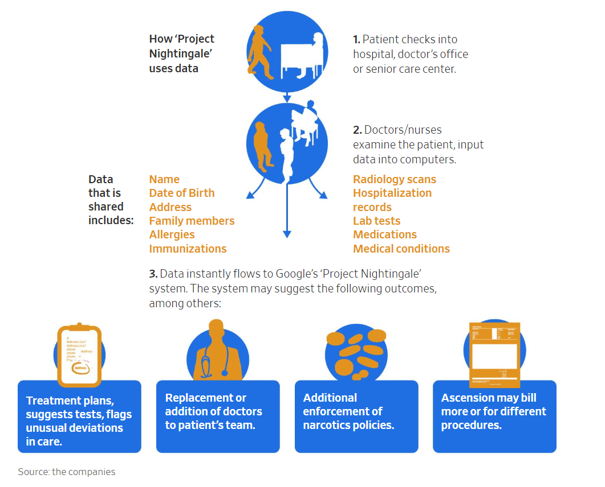
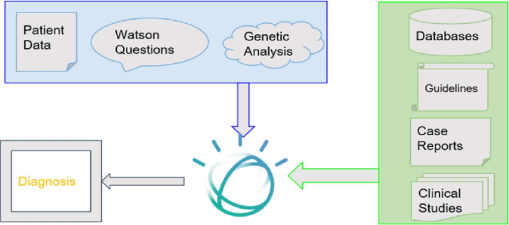
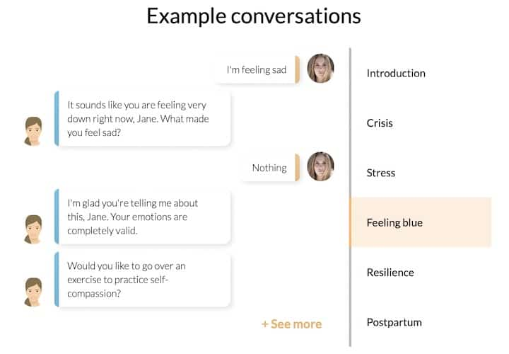

# Regulatory and Ethical Issues

## The Regulatory Challenge

Regulatory frameworks exist across a variety of industries. Unlike ethics, regulations are pragmatic, practical and objective.

The objectives of a regulatory framework relevant to this class are:
- _Protect Public Interest & Safety_ – Ensures professionals adhere to standards that prevent harm to individuals and society.
- _Standardize Practices_ – Creates uniform guidelines for services to ensure consistency and reliability across an industry
- _Legal Accountability_ – Provides mechanisms to address misconduct, negligence, or incompetence.
- _Facilitate Fair Competition_ – Prevents unqualified individuals from undermining legitimate professionals.

## AI and Regulation

- When AI is used within an industry, its use should conform to the regulatory frameworks for that industry. AI should not be exempt
- However, since AI applications use data, health care AI may also be subject to other regulatory frameworks like data storage and security regulations.
- The same activity may be regulated by different oversight organizations who have interests in specific dimensions of the AI operations

## Relevant Health Care Regulations

The following are some of the main legal frameworks that AI in health care must abide by. 

US Federal Regulations on Healthcare
- Health Insurance Portability and Accountability Act (HIPAA)
- Health Information Technology for Economic and Clinical Health (HITECH) Act
- 21st Century Cures Act (Interoperability and Information Blocking Rules)
- Food and Drug Administration (FDA) regulations for AI-driven medical devices
- Federal Trade Commission (FTC) AI & data privacy enforcement

Protected Health Information (PHI) & AI addresses
- How AI systems handle electronic health records (EHRs)
- How Ensuring AI-driven data collection and storage comply with HIPAA Security & Privacy Rules

Patient Consent and AI
- Informed consent for AI-based diagnostics and treatment recommendations
- Explainability in AI-driven healthcare decisions to obtain meaningful consent

State-Specific AI & Privacy Laws
- California Consumer Privacy Act (CCPA) and implications for AI in healthcare

De-Identification & Anonymization of Health Data
- Ensuring compliance with HIPAA Safe Harbor and Expert Determination standards
- Risks of re-identification in AI-driven health analytics

##  Google’s Project Nightingale (2019) Case Study

Google partnered with Ascension Health, the second-largest U.S. healthcare system, to develop an AI-powered patient care system. 

Regulatory Issues
- The project secretly collected millions of patient records without notifying patients or obtaining explicit consent.
- HIPAA Violation Risks – Data sharing occurred without proper patient consent.
- Lack of Transparency – Patients were unaware their medical records were being used for AI training.
- Privacy & Security Risks – Storing sensitive health data with Google raised concerns over potential misuse.
- [Project Nightingale Review](https://www.techtarget.com/searchhealthit/definition/Project-Nightingale)
- [Google Made a Huge Mistake--and Now Project Nightingale Is a Scandal. It Didn't Have to Be That Way](https://www.inc.com/cameron-albert-deitch/google-ascension-project-nightingale-scandal-transparency.html)

+scandal&t=newext&atb=v464-1&iar=images&iax=images&ia=images&iai=https%3A%2F%2Fhitconsultant.rapidload-cdn.io%2Fwp-content%2Fuploads%2F2019%2F11%2FGoogle-Nightingale-WSJ.png)

Outcomes

- The U.S. Department of Health and Human Services (HHS) launched an investigation into HIPAA compliance.
- Google and Ascension claimed the project complied with regulations, but the lack of patient awareness led to public backlash.
- Highlighted the need for transparency in AI-driven healthcare collaborations.

## IBM Watson for Oncology 

IBM Watson was designed to assist oncologists in recommending cancer treatments based on AI-driven insights. 

However, the system produced unsafe and incorrect treatment suggestions due to biased training data.

Regulatory Issues
- Algorithmic Bias – The AI was trained mostly on American cancer patient data, making it unreliable for global cancer treatment recommendations.
- Inaccurate AI Decisions – Watson suggested potentially dangerous treatments, such as prescribing highly toxic drugs for non-severe cases.
- Lack of Explainability – Doctors couldn’t interpret Watson’s reasoning, reducing trust in AI-powered medical decisions.
- [The $4 Billion AI Failure of IBM Watson for Oncology](https://www.henricodolfing.com/2024/12/case-study-ibm-watson-for-oncology-failure.html)

Outcomes
- Multiple hospitals, including MD Anderson Cancer Center, discontinued Watson AI due to errors and poor performance.
- IBM failed to achieve large-scale adoption, leading to a loss of credibility in AI-driven cancer treatment.
- The case emphasized the importance of bias reduction and transparent AI decision-making in healthcare.

## Epic Systems’ AI Sepsis Prediction Model

Epic, a leading EHR provider, developed an AI model to predict sepsis risk in hospitalized patients. The model aimed to identify sepsis early and reduce mortality rates. However, a 2021 study revealed major flaws in its accuracy.

Regulatory & Ethical Issues
- False Positives & False Negatives – The model missed 67% of actual sepsis cases and generated too many false alarms.
- Lack of FDA Oversight – The AI was not independently validated before deployment in hospitals.
- Liability & Accountability – Who is responsible when an AI model fails in a life-threatening scenario?
- [Widely used AI tool for early sepsis detection may be cribbing doctors’ suspicions](https://news.umich.edu/widely-used-ai-tool-for-early-sepsis-detection-may-be-cribbing-doctors-suspicions/)
- [External Validation of a Widely Implemented Proprietary Sepsis Prediction Model in Hospitalized Patients](https://www.semanticscholar.org/paper/External-Validation-of-a-Widely-Implemented-Sepsis-Wong-Otles/c06c28ea122996011bff422242f95f86e0fe2aab)

Outcomes

- The AI model was widely criticized for being unreliable in real-world settings.
- Raised concerns over "black box" AI models that lack transparency in medical decision-making.
- Led to calls for stronger AI validation, FDA oversight, and independent audits before clinical use.

## FDA’s First AI-Approved Diagnostic Device

IDx-DR became the first AI-powered diagnostic device approved by the FDA to detect diabetic retinopathy in patients without a physician’s involvement.

Regulatory Successes
- FDA Oversight & Approval – The system underwent rigorous testing before deployment.
- AI Accountability – The AI did not replace doctors but assisted them, ensuring proper medical oversight.
- Patient Consent & Transparency – Patients were informed that AI, not a human doctor, was making the diagnosis.
- [Artificial Intelligence and Diabetic Retinopathy: AI Framework, Prospective Studies, Head-to-head Validation, and Cost-effectiveness](https://diabetesjournals.org/care/article/46/10/1728/153626/Artificial-Intelligence-and-Diabetic-Retinopathy)

Outcomes
- Successfully deployed across U.S. clinics, reducing costs and wait times for diabetic retinopathy screening.
- Served as a model for AI regulatory approval, proving AI can be safely integrated into clinical decision-making.
- Led to FDA developing a new regulatory framework for adaptive AI medical devices

## AI in Mental Health 

Facebook partnered with mental health organizations to develop an AI tool that detects suicidal behavior in social media posts. 

Similarly, the U.S. Department of Veterans Affairs (VA) deployed AI to predict suicide risk in veterans.

Regulatory Issues
- Privacy Violations & Data Ethics – AI analyzed private messages without user consent.
- False Positives & Negative Impacts – Some users were wrongly flagged as suicidal, while others at risk were missed.
- AI Decision-Making Without Human Oversight – The system triggered emergency interventions, leading to privacy and autonomy concerns.
- [Facebook is using A.I. to help predict when users may be suicidal](https://www.cnbc.com/2018/02/21/how-facebook-uses-ai-for-suicide-prevention.html)
- [VA’s AI model to prevent suicides is a game changer](https://www.govexec.com/workforce/2024/05/vas-ai-model-prevent-suicides-game-changer-official-says/396572/)

Outcomes
- Facebook faced criticism for privacy violations but continued improving AI detection models.
- The VA AI program raised ethical concerns, prompting calls for human oversight in AI-driven mental health screenings.
- Highlighted the need for ethical AI in mental health applications, balancing privacy, accuracy, and human intervention.

## Conclusion & Lessons Learned

- _Data Privacy & Compliance_ – Google’s Project Nightingale shows the importance of HIPAA compliance and patient consent in AI.
- _Bias & Fairness_ – IBM Watson for Oncology project highlights the risks of AI bias and racial disparities.
- _Accountability & Transparency_ – Epic’s Sepsis AI Failure and mental health AI detection show the need for explainable AI and human oversight.
- _Successful AI Integration_ – IDx-DR proves AI can be effectively regulated and used ethically in healthcare.

## Ethical Use of AI in Decision-Making

Ethics can are the best practices of an industry that exist with or without regulatory oversight
- For example, the doctor's credo "Do no harm"
- Embodied in health care as the standards of care provided to patients
- And acts as guidelines for making decisions that are in the best interests of the patient and other stakeholders

## Areas of Ethical Concern for AI in Health Care

AI Bias in Healthcare Decision-Making
- Biased AI training data leads to racial, gender, and socioeconomic disparities in treatments
- Requires identifying and controlling bias in diagnostic AI, predictive analytics, and risk assessment models

AI vs. Human Judgment
- The role of physicians vs. AI in diagnosis and treatment decisions
- Ethical risks of over-reliance on AI for clinical decision-making
- May result in ignoring the intangible factors that are used by humans to make optimal decisions
- AI does not handle ethical dilemmas well because the empathy factor is not present

Fairness & Equity in AI-Based Healthcare Systems
- Ensuring AI benefits underserved communities (e.g., rural populations, minorities) as well as those who can afford it
- Do the training datasets accurately sample the population to be serviced

AI in Mental Health & Behavioral Analytics
- Ethical concerns of AI predicting suicide risks, PTSD, and depression
- These are usually emotionally based issues and require different skill sets than psychical health issues
- There is not a consensus on these issues among human practitioners so that problem is compounded when AI systems are added to the mix.
- Privacy risks in AI-driven mental health chatbots that do not have the same doctor patient confidentiality as human practitioners 

AI-Generated Medical Diagnoses & Treatment Plans
- Ensuring AI does not reinforce human biases in medical diagnostic data interpretations

Use of AI in Drug Development & Clinical Trials
- Bias in AI-driven patient recruitment for trials

## AI-Powered Mental Health Chatbots 

AI-driven chatbots like Woebot, Replika, and Wysa offer mental health support through conversational AI. While they provide accessible therapy, there are ethical risks in relying on AI for mental health care.

Ethical Issues
- Lack of Emotional Intelligence – AI lacks human empathy and contextual understanding, making responses feel robotic.
- False Sense of Security – Users may trust AI therapy instead of seeking professional help when needed.
- Data Privacy & Exploitation Risks – These AI chatbots collect sensitive psychological data, which could be misused for targeted advertising or research.
- [Do Mental Health Chatbots Work?](https://www.healthline.com/health/mental-health/chatbots-reviews)

Outcomes

- Ensuring that AI-driven mental health tools should only supplement, not replace, human therapists.
- Ethical guidelines on AI’s role in mental healthcare to prevent harm to vulnerable users.

## AI-Based Predictive Policing for Opioid Abuse

AI models have been used to predict which patients might misuse opioids, aiming to reduce over prescription and overdose deaths. 

However, these models disproportionately flagged minorities and lower-income patients, leading to ethical concerns.

Ethical Issues
- Bias Against Marginalized Groups – AI models over-predicted opioid abuse in Black and Hispanic patients, reinforcing healthcare disparities.
- Stigmatization of Patients – Patients flagged by AI faced difficulties in obtaining legitimate pain medication.
- Lack of Transparency & Accountability – The criteria AI used to label patients as “high-risk” was unclear, leading to potential discrimination.
- [Big data and predictive modelling for the opioid crisis: existing research and future potential](https://www.thelancet.com/journals/landig/article/PIIS2589-7500(21)00058-3/fulltext)

Outcomes

- Some hospitals stopped using AI for opioid risk assessment due to fairness concerns.
- Raised ethical debates on whether AI should influence medical decisions that impact patient dignity and trust.

## AI in Dementia & Alzheimer’s Diagnosis

AI models have been used to predict the early onset of Alzheimer’s and dementia based on MRI scans and speech patterns. However, early detection without clear treatment options raises ethical concerns.

Ethical Issues
- Psychological Harm of Premature Diagnosis – Is it ethical to tell patients they have a high chance of developing dementia if no cure exists?
- Insurance & Employment Discrimination Risks – If AI-predicted dementia risks are shared, patients could face higher insurance rates or job discrimination.
- Patient Autonomy & AI Predictions – Should AI models be allowed to override doctors’ clinical judgment in neurodegenerative disease prediction?
- [Artificial Intelligence for Alzheimer’s Disease: Promise or Challenge?](https://pmc.ncbi.nlm.nih.gov/articles/PMC8391160/)

Outcomes
- Ethical debates continue on whether AI-driven early diagnosis is beneficial or harmful.
- Researchers call for guidelines on how predictive AI results should be communicated to patients.

## AI-Generated Fake Medical Research

AI-generated text models (like GPT-based systems) have been used to create fake medical research papers, sometimes with fabricated data.

Ethical Issues
- Trust & Integrity in Medical Research – AI-generated research may contain false medical claims, misleading doctors and policymakers.
- Academic & Scientific Fraud – AI could be misused to fabricate patient data in clinical trials, undermining public trust.
- Lack of AI Regulation in Medical Publishing – Should AI-generated research papers be subject to stricter verification processes?
- [Artificial Intelligence Can Generate Fraudulent but Authentic-Looking Scientific Medical Articles: Pandora’s Box Has Been Opened](https://pmc.ncbi.nlm.nih.gov/articles/PMC10267787/)

Outcomes
- Medical journals are developing AI-detection tools to prevent fake research publications.
- Raised ethical concerns about how AI can be misused to generate false scientific claims.

## AI in End-of-Life Care Predictions 

AI models have been deployed to predict how long terminally ill patients will live, helping doctors provide better end-of-life care planning. However, ethical concerns have emerged around prediction someone's death.

Ethical Issues
- Should AI Predict Death? – Is it ethical to tell a patient how long they have to live based on AI models?
- Psychological & Emotional Impact – AI predictions can cause distress and anxiety for patients and families.
- False Positives & Hope Deprivation – If AI wrongly predicts shorter life expectancy, patients may give up on treatment options too soon.
- [Ethical Considerations In The Use Of AI Mortality Predictions In The Care Of People With Serious Illness](https://www.healthaffairs.org/content/forefront/ethical-considerations-use-ai-mortality-predictions-care-people-serious-illness)

Outcomes
- Some hospitals allow patients to opt-out of AI-based death predictions.
- Ethical debates continue on whether AI should be used for life expectancy predictions without human oversight and counseling support.

## Takeaways for AI Healthcare Ethical Issues

- _AI Bias & Fairness_ – THe opioid abuse predictions show how AI can reinforce healthcare inequalities.
- _Trust & Human Oversight_ – Predictive death models highlight the risks of over-relying on AI.
- _Privacy & Psychological Risks_ – AI in mental health and dementia prediction raises concerns about patient dignity and ethical AI use.
- _Scientific Integrity_ – AI-generated research fraud calls for stronger ethical guidelines in AI-assisted scientific publications.

## Transparency And Accountability for AI in Healthcare

Transparency is:
- The open and clear communication of healthcare information, policies, costs, and decision-making processes to patients, healthcare providers, and regulators
- Ensures that stakeholders have access to accurate, understandable, and timely information about healthcare services, pricing, quality, and outcomes.

Accountability is:
- The responsibility of healthcare organizations, providers, and AI-driven systems to deliver high-quality, ethical, and compliant care while being answerable for their actions, decisions, and outcomes.

**Transparency** ensures that healthcare practices and AI-driven decisions are visible and understandable.

**Accountability** ensures that when errors, biases, or unethical actions occur, responsible parties are held accountable.

## Dimensions of Transparency 

- _Price Transparency_ – Patients should know the costs of treatments, procedures, and medications before receiving care 
- _Clinical Transparency_ – Clear disclosure of how medical decisions are made, including AI-assisted diagnostics and treatments.
- _Data Transparency_ – Patients should understand how their electronic health records (EHRs) and personal data are collected, stored, and used. Including their use as training data for AI
- _Algorithmic Transparency_ – When AI is used in diagnosis or treatment, patients and doctors should know how decisions are made and be able to explain those decisions to patients.
- _Provider Transparency_ – Healthcare facilities must disclose quality ratings, patient outcomes, and safety measures.

## Dimensions of Accountability

- _Legal Accountability_ – Compliance with HIPAA, FDA regulations, and malpractice laws ensures patient safety and privacy.
- _Ethical Accountability_ – AI developers and healthcare providers must prevent bias, discrimination, and unethical decision-making.
- _Clinical Accountability_ – Doctors, hospitals, and AI-driven diagnostic tools are responsible for accurate diagnoses and patient care.
- _AI & Machine Learning Accountability_ – Developers of AI systems used in medicine must ensure their models are fair, explainable, and free of harmful bias.
- _Financial Accountability_ – Hospitals, insurers, and pharmaceutical companies must be transparent about billing, insurance claims, and financial conflicts of interest.

## Transparency Issues in AI Based Medical Care

Black-Box AI Models in Healthcare
- Many AI-powered medical tools use complex machine learning algorithms that make it difficult for doctors and patients to understand how decisions are made.

Lack of Transparency in AI Training Data
- Many AI healthcare models are trained on biased or non-representative datasets, but developers do not disclose the sources of training data.

AI-Generated Patient Risk Scores Without Explanation
- Hospitals use AI to predict patient deterioration, sepsis risk, and readmission rates, but these AI-generated risk scores are often not explained to doctors.

Undisclosed Commercial & Financial Interests in AI Healthcare Tools
- Some AI-driven healthcare systems do not disclose financial conflicts of interest, such as pharmaceutical companies funding AI drug recommendations.

Misdiagnosis
- AI is increasingly used for radiology, pathology, and MRI diagnostics, but many AI models do not explain why an image is flagged as abnormal.

Lack of Patient Consent & Awareness 
- Many healthcare institutions do not inform patients when AI is involved in diagnosing their condition or planning treatment.
- Some providers use AI chatbots for mental health, symptom checking, and scheduling, but do not always disclose to patients that they are interacting with AI.

## Accountability Issues

Legal Liability Gap
- When an AI-powered system misdiagnoses a patient or recommends the wrong treatment, it is unclear who is legally responsible—the hospital, doctor, AI developer, or software provider?

AI Bias Leading to Unfair Patient Treatment
- AI models in healthcare have been proven to exhibit bias against minority populations, leading to unequal treatment and discrimination.
- AI systems that under-diagnose or misdiagnose Black and Hispanic patients may worsen racial disparities in healthcare.
- Patients may suffer harm, but current U.S. laws do not hold AI vendors accountable for biased algorithms.

Replacing Human Judgment Without Oversight
- AI is increasingly making diagnostic, treatment, and triage decisions without human oversight, leading to potential medical errors.
- Doctors may over-rely on AI recommendations, reducing critical thinking in medical decision-making
- Where is the liability when bad AI decisions are followed by medical staff

##  Mayo Clinic’s AI Governance Board 

Mayo Clinic, has implemented an AI Governance Board to oversee the development, deployment, and ethical use of AI in patient care.

AI Accountability Measures Taken
- Independent AI Audits – AI models are reviewed by internal and external experts before deployment.
- Bias & Fairness Testing – AI models are tested on diverse patient populations to reduce racial and gender biases.
- Explainability & Physician Review – AI-powered diagnoses must be explainable and reviewed by human doctors before clinical use.
- Patient Consent & Transparency – Patients must be informed when AI is involved in their treatment.
- [Mayo Clinic’s Healthy Model for AI Success](https://sloanreview.mit.edu/article/mayo-clinics-healthy-model-for-ai-success/)

Outcomes
- Mayo Clinic’s AI-driven diagnostic tools have higher physician trust and patient safety standards compared to institutions without such governance. 
- Their approach is now used as a model for AI accountability in hospitals across the U.S.

## Stanford University’s AI Fairness & Accountability Initiative

Stanford University launched an AI Ethics and Accountability Initiative to ensure responsible AI deployment in healthcare and reduce biases in medical AI systems.

AI Accountability Measures Taken
- Bias & Fairness Audits – AI models undergo statistical fairness testing to detect racial and gender disparities.
- AI Explainability Research – Stanford researchers work on making AI models more interpretable for doctors and patients.
- Independent AI Ethics Reviews – AI tools used in medicine must pass an ethical review process before clinical trials.
- [Report outlines Stanford principles for use of AI](https://news.stanford.edu/stories/2025/01/report-outlines-stanford-principles-for-use-of-ai)

Outcomes
- Stanford’s AI bias audits have identified unfair treatment risks in AI models used for predicting heart disease and cancer diagnoses.
- Their fairness framework is now used by healthcare AI developers to create more accountable and unbiased AI models.

## Kaiser Permanente’s AI Risk Management Framework

Kaiser Permanente, developed an AI Risk Management Framework to ensure AI-driven patient care remains safe and ethical.

AI Accountability Measures Taken
-  Physician-AI Collaboration Model – AI does not make final medical decisions; human doctors always have the final say.
- Internal AI Risk Audits – AI models undergo quarterly safety and bias checks to ensure fairness.
- Patient AI Awareness Program – Patients are informed when AI is involved in their diagnosis and have the option to opt out.
- [Fostering responsible AI in health care](https://about.kaiserpermanente.org/news/fostering-responsible-ai-in-health-care)

Outcomes
- Kaiser Permanente’s AI-powered diagnostics have lower error rates than national averages due to continuous AI monitoring and accountability policies.
- Their framework has been recommended for adoption by other U.S. hospital networks.

