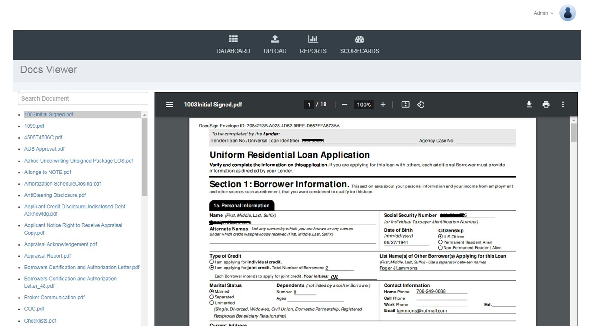
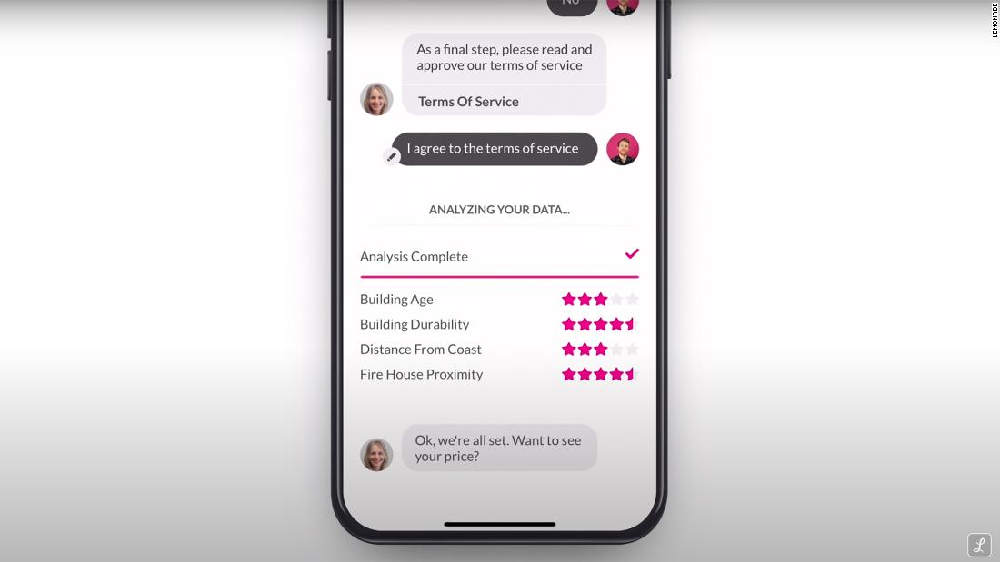
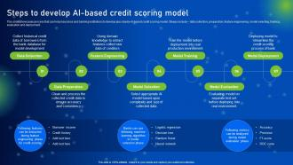
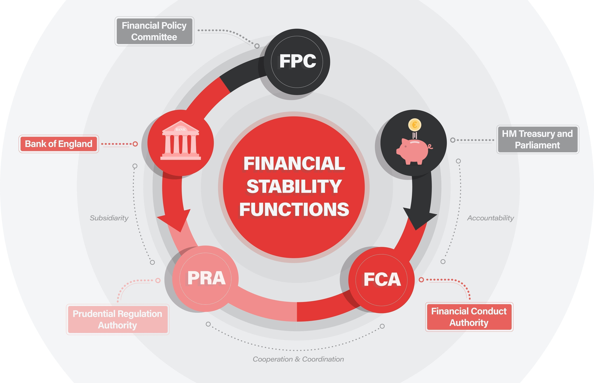
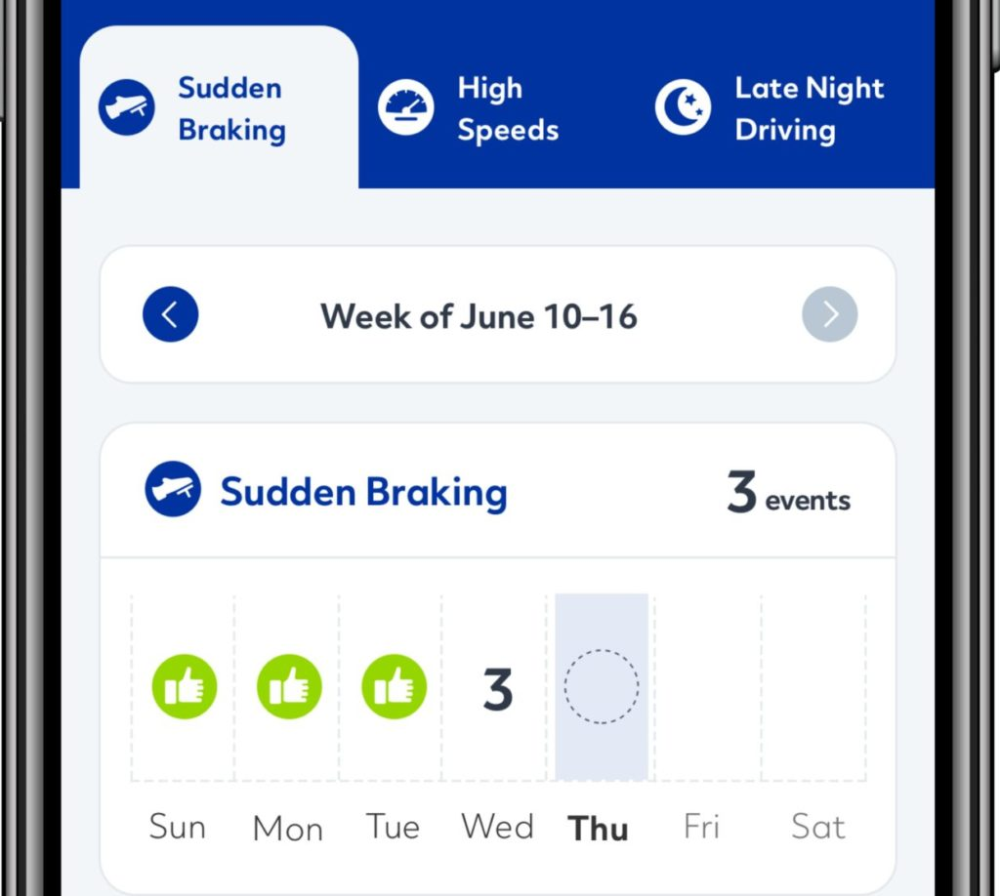

## AI’s Role in Risk Assessment and Underwriting

Traditional vs. AI-powered risk assessment
- Traditional underwriting relies on manual reviews, historical data, and human expertise.
- AI-powered underwriting uses machine learning models to assess risk in real-time.

Key Benefits of AI in Risk Assessment
- Faster Decision-Making – AI processes vast datasets instantly.
- Improved Accuracy – AI minimizes human error and bias.
- Cost Efficiency – Automates repetitive tasks, reducing operational expenses.

AI Technologies Transforming Risk Assessment:
- Machine Learning Algorithms – Predict default rates, fraud risk, and customer creditworthiness.
- Natural Language Processing (NLP) – Extracts insights from legal contracts, financial reports, and customer data.
- Computer Vision – Analyzes document authenticity for fraud detection.

## Case Study: JPMorgan Chase’s AI-Driven Loan Underwriting

The bank needed faster, more accurate loan approvals while reducing default risks.

AI Strategy
- Deployed machine learning models to analyze borrower data beyond credit scores.
- Used alternative data sources (social media, transaction history, behavioral analytics) for better predictions.
- [The Impact of AI on JP Morgan Chase's Operational Efficiency and Decision-Making](https://ijsret.com/wp-content/uploads/2024/01/IJSRET_V10_issue1_138.pdf)

Outcomes:
- Reduced loan approval times by 50%.
- Improved default risk detection, lowering non-performing loans by 15%.
- Leadership Lesson: AI-powered underwriting enables data-driven, real-time lending decisions.

## AI-Driven Predictive Analytics in Risk Assessment
   
AI uses historical and real-time data to predict future risk events.
- Helps insurers and financial firms proactively adjust policies. 

AI-enhanced risk modeling
- Credit Risk Modeling – AI predicts borrower default probabilities.
- Fraud Detection Models – Identifies suspicious transactions and fraudulent claims.
- Actuarial Risk Analysis – AI refines insurance pricing and policy structuring.

Data sources for AI risk modeling
- Traditional credit scores
- Social media behavior
- IoT (Internet of Things) data (e.g., telematics in auto insurance)
- Geopolitical and economic indicators

## Case Study: Lemonade Insurance’s AI-Powered Underwriting

Lemonade, a digital insurer, needed faster, automated risk assessment for policy approvals.

AI Strategy:
- Used deep learning models to analyze customer data and claims history.
- Implemented automated chatbot-based underwriting with real-time risk scoring.
- [AI Eats Insurance]https://www.lemonade.com/blog/ai-eats-insurance/()

Outcomes
- AI approved insurance policies in under 90 seconds.
- Reduced claims fraud by 30% through AI fraud detection.
- Leadership Lesson: AI improves underwriting efficiency and fraud detection, making insurance more accessible.

## AI and Automated Decision-Making in Underwriting
  
AI can approve, reject, or flag loan/insurance applications based on data-driven risk analysis.

Reduces the need for manual underwriter intervention in low-risk cases.

 Challenges with fully automated underwriting
 - AI Bias & Fairness Issues – AI must be trained on diverse, unbiased datasets.
 - Regulatory & Compliance Concerns – AI underwriting must comply with anti-discrimination laws (e.g., Fair Lending Laws, GDPR).
 - Lack of Explainability (Black-Box AI) – AI decisions should be transparent and interpretable.

## Case Study: FICO’s AI-Based Credit Scoring

Traditional credit scores failed to assess the creditworthiness of new borrowers with limited history.

AI Strategy:
- Developed FICO Score X, an AI-driven credit scoring model.
- Used alternative data (utility payments, mobile transactions) to assess risk.
- [Using Augmented Intelligence and Machine Learning in Credit Scoring](https://www.fico.com/blogs/using-augmented-intelligence-and-machine-learning-credit-scoring)

Outcomes
- Enabled financial inclusion for 30% more applicants.
- Increased loan approval rates while maintaining risk levels.
- Leadership Lesson: AI underwriting must balance automation with transparency and fairness.

## Regulatory and Ethical Considerations in AI Underwriting
   
Key regulations impacting AI-driven risk assessment
- Fair Lending Laws – AI underwriting must be non-discriminatory (e.g., Equal Credit Opportunity Act).
- GDPR & CCPA – AI models must ensure customer data privacy and consent.
- Insurance Regulatory Compliance – AI-driven policy pricing must be explainable and unbiased.

How to ensure ethical AI use in Underwriting:
- Use explainable AI (XAI) to provide clear reasoning behind AI decisions.
- Conduct regular bias audits on underwriting models.
- Implement human-AI collaboration for reviewing high-risk cases.

## Case Study: UK Financial Conduct Authority (FCA) AI Compliance Initiative

The FCA investigated AI models in financial underwriting for potential bias and unfair credit rejections.

Regulatory Response
- Mandated transparency in AI risk models for financial firms.
- Required bias testing and customer recourse options for AI-based rejections.
- [Our emerging regulatory approach to Big Tech and Artificial Intelligence](https://www.fca.org.uk/news/speeches/our-emerging-regulatory-approach-big-tech-and-artificial-intelligence)

Outcomes
- Ensured AI-powered lending models were fair and explainable.
- Increased consumer trust in AI-based credit approvals.
- Leadership Lesson: Regulatory compliance must be a core part of AI underwriting strategies.

%% Future Trends in AI-Driven Risk Assessment and Underwriting
   
- Behavioral Risk Analytics – AI will use real-time behavioral data to predict customer risk levels.
- AI + Blockchain for Transparency – Blockchain will provide tamper-proof underwriting records.
- Federated Learning for Secure AI Training – AI will train on decentralized data without privacy risks.

Preparing for the Future of AI Underwriting
- Invest in AI explainability tools to maintain compliance.
- Adopt AI-human hybrid models for risk assessment.
- Ensure continuous AI model audits and retraining to improve accuracy.

## Case Study: Allstate’s AI-Powered Telematics Insurance

Allstate wanted more personalized auto insurance pricing based on driving behavior.

AI Strategy
- Used IoT-enabled telematics devices to track real-time driving data.
- Applied AI risk models to adjust insurance premiums dynamically.
- [Unraveling the AI Ecosystem: A Scientific Exploration of Allstate, an S&P 500 Company](https://www.cash-platform.com/unraveling-the-ai-ecosystem-a-scientific-exploration-of-allstate-an-sp-500-company/)

Outcomes
- Reduced accident claims by 15% among AI-driven policyholders.
- Increased customer adoption of AI-powered insurance plans.
- Leadership Lesson: AI-driven risk assessment will become more personalized and real-time.
 s
## Summary 

- AI speeds up risk assessment and enhances accuracy in underwriting decisions.
- Predictive analytics helps financial institutions and insurers proactively manage risk.
- Automated underwriting must balance efficiency with fairness and regulatory compliance.
- Executives must track AI’s evolving role in underwriting to remain competitive.